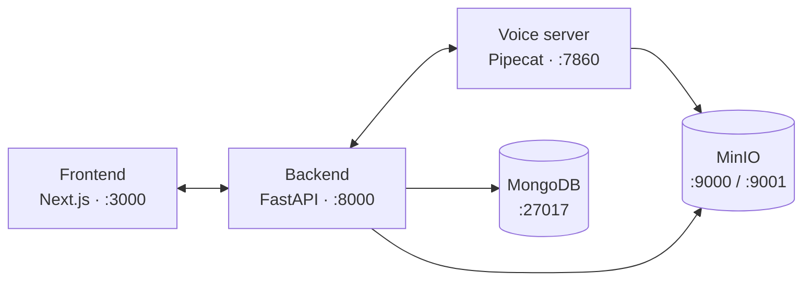

# Welcome to VoicEra

**VoicEra** is an open-source voice AI platform for building real-time conversational phone agents in Indian languages. It bundles speech-to-text, large language models, text-to-speech, and telephony into a single stack you can self-host.

Use VoicEra to run inbound helplines, outbound campaigns, IVR replacements, and citizen-services hotlines — without writing voice infrastructure from scratch.


New here? Start with [What is VoicEra](introduction/what-is-voicera.md) for the plain-language overview, or jump straight to the [Quickstart](quickstart/install-and-run.md) if you have Docker ready.


## What you get

| Capability | What it does |
| --- | --- |
| **Real-time voice agents** | Sub-second STT → LLM → TTS loop powered by [Pipecat](concepts/voice-pipeline.md). |
| **Indian-language support** | Local STT/TTS via [AI4Bharat](services/ai4bharat-stt.md) servers or hosted providers. |
| **Telephony integration** | Inbound and outbound calls through [Vobiz](concepts/telephony-model.md) over WebSocket. |
| **Knowledge base (RAG)** | Ground answers in your own PDFs and documents. See [Knowledge base](concepts/knowledge-base-rag.md). |
| **Web dashboard** | Configure agents, link numbers, run campaigns, review transcripts and recordings. |
| **Self-hosted** | Docker Compose stack. Your data, your servers, your model keys. |

## Where to start

| If you are… | Start here |
| --- | --- |
| **Evaluating or demoing** | [Prerequisites](quickstart/prerequisites.md) → [Install and run](quickstart/install-and-run.md) → [Your first call](quickstart/first-call.md) |
| **An operator using the dashboard** | [Dashboard tour](guides/operator/dashboard-tour.md) → [Daily operations](guides/operator/operations.md) |
| **A developer building or extending** | [Architecture](concepts/architecture.md) → [Local setup](guides/developer/local-setup.md) → [REST API](reference/rest-api.md) |

## Architecture at a glance

Three services, two stores, optional local AI servers. Full diagram and call flow in [Architecture](concepts/architecture.md).

## Project links

* **Source** — [github.com/COSS-India/voicera\_mono\_repository](https://github.com/COSS-India/voicera_mono_repository)
* **License** — [MIT](legal/license.md)

## Need help?

* Browse the [Troubleshooting](troubleshooting/common-issues.md) section.
* Search the [Glossary](concepts/glossary.md) for unfamiliar terms.
* Open an issue on GitHub.
