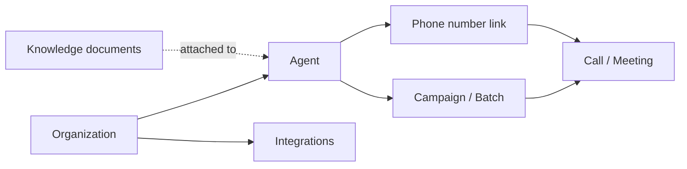
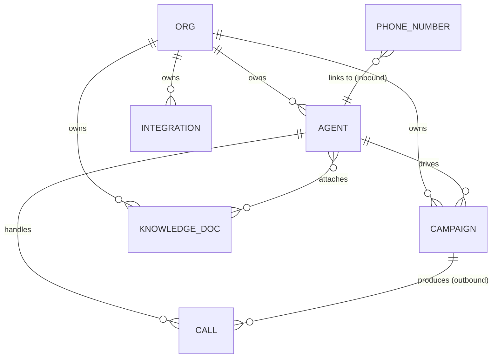

# Agents, campaigns, and calls

This page explains VoicEra's three primary domain objects — **agents**, **campaigns** (also called batches), and **calls** (meetings) — and how they relate. It is the mental model that the dashboard, REST API, and voice server all share.


In VoicEra, an "agent" is a software configuration, **not** a human employee. It defines how the voice bot behaves on a call.


## At a glance



| Object | What it represents | Created by |
| --- | --- | --- |
| Agent | A reusable voice-bot configuration (LLM/STT/TTS, prompt, language, KB, telephony). | Operator on **Assistants**. |
| Campaign / Batch | A list of phone numbers to dial outbound using one agent. | Operator on **Campaigns**. |
| Call / Meeting | One conversation between a caller and an agent (inbound or outbound). | Created automatically per call. |
| Phone number link | A binding between a Vobiz number and one agent for inbound calls. | Operator on **Phone numbers**. |
| Knowledge document | A PDF embedded in the org's Chroma store, optionally attached to agents. | Operator on **Knowledge**. |

## Agent

An **agent** is the configuration that drives the voice pipeline for every call it handles.

### Schema (MongoDB `agents`)

```json
{
  "_id": "ObjectId(...)",
  "id": "agent-uuid",
  "org_id": "org-uuid",
  "user_id": "user-uuid",
  "name": "Support agent",
  "description": "Handles tier-1 customer queries",
  "llm_provider": "OpenAI",
  "llm_model": "gpt-4o-mini",
  "stt_provider": "Deepgram",
  "tts_provider": "Cartesia",
  "system_prompt": "You are a helpful support agent...",
  "greeting_message": "Hi, how can I help you today?",
  "language": "en",
  "voice_parameters": {
    "voice_id": "english_male",
    "speed": 1.0,
    "tone": "professional"
  },
  "telephony_provider": "Vobiz",
  "knowledge_base_enabled": true,
  "knowledge_document_ids": ["doc-uuid-1"],
  "knowledge_top_k": 10,
  "interruption_min_words": 1,
  "ignore_user_speech_before_greeting": true,
  "user_online_detection_enabled": false,
  "user_silence_hangup_seconds": 0,
  "status": "active",
  "created_at": "2024-05-01T10:00:00Z",
  "updated_at": "2024-05-01T10:00:00Z"
}
```

### What an agent owns

- **AI providers** for STT, LLM, and TTS — each pluggable per agent.
- **Behavioural config** — system prompt, greeting, barge-in thresholds, silence handling.
- **Language** — propagated to STT and TTS where applicable.
- **Knowledge attachments** — `knowledge_document_ids` controls which docs are searched at call time.
- **Telephony provider** — currently Vobiz on most deployments; Plivo when enabled.

### Lifecycle

| Status | Meaning |
| --- | --- |
| `active` | Available to handle calls. |
| `inactive` | Hidden from new call routing. |
| `archived` | Soft-deleted; historical calls retain a reference. |


Provider API keys are **not** stored on the agent. They come from per-organisation **Integrations** at call time. See [telephony-model.md](telephony-model.md) and [../services/integrations.md](../services/integrations.md).


## Campaign (batch)

A **campaign** is a list of outbound numbers driven by one agent. It is sometimes called a **batch** in the API (`/api/v1/batches`).

### Schema (MongoDB `campaigns`)

```json
{
  "_id": "ObjectId(...)",
  "id": "campaign-uuid",
  "org_id": "org-uuid",
  "user_id": "user-uuid",
  "agent_id": "agent-uuid",
  "name": "May launch outreach",
  "description": "Welcome calls for May signups",
  "phone_numbers": ["+91XXXXXXXXXX", "..."],
  "audience_csv_path": "campaigns/campaign-uuid/audience.csv",
  "status": "scheduled",
  "start_time": "2024-05-10T09:00:00Z",
  "end_time":   "2024-05-10T18:00:00Z",
  "max_concurrent_calls": 5,
  "retry_config": {
    "max_retries": 2,
    "retry_delay": 600
  },
  "created_at": "2024-05-01T10:00:00Z"
}
```

### Status values

| Status | Meaning |
| --- | --- |
| `draft` | Created but not yet launched. |
| `scheduled` | Will start at `start_time`. |
| `active` | Currently dialling numbers from the audience. |
| `paused` | Stopped temporarily; in-flight calls allowed to finish. |
| `completed` | All numbers attempted (or window closed). |

### Inbound vs outbound

- **Outbound** calls are driven by campaigns: the worker pops numbers from the audience and asks the voice server to place a Vobiz call.
- **Inbound** calls do **not** require a campaign — they are routed by the phone-number-to-agent link configured under **Phone numbers**.

## Call (meeting)

A **call** (also called a **meeting** in the UI) is one conversation: one caller, one agent, one Vobiz `call_sid`.

### Schema (MongoDB `call_logs` / `meetings`)

```json
{
  "_id": "ObjectId(...)",
  "id": "call-uuid",
  "org_id": "org-uuid",
  "agent_id": "agent-uuid",
  "campaign_id": "campaign-uuid",
  "direction": "inbound",
  "phone_number": "+91XXXXXXXXXX",
  "caller_id": "+91YYYYYYYYYY",
  "call_sid": "vobiz-call-sid",
  "stream_sid": "vobiz-stream-sid",
  "status": "completed",
  "duration_seconds": 142,
  "transcript": "User: ... Agent: ...",
  "transcript_path": "transcripts/call-uuid.txt",
  "recording_path": "recordings/call-uuid.mp3",
  "summary": "Caller asked about return policy; resolved.",
  "sentiment": "positive",
  "emotions": ["satisfied"],
  "key_phrases": ["return policy", "30 days"],
  "latency_metrics": {
    "avg_stt_ms": 298,
    "avg_llm_ttfb_ms": 512,
    "avg_tts_first_chunk_ms": 180
  },
  "hangup_cause": "USER_HANGUP",
  "created_at": "2024-05-10T10:30:00Z",
  "updated_at": "2024-05-10T10:32:22Z"
}
```

### Status values

| Status | Meaning |
| --- | --- |
| `initiated` | Outbound dial issued. |
| `ringing` | Vobiz reports ring on the destination. |
| `connected` | WSS open, pipeline running. |
| `completed` | Hangup received, artifacts saved. |
| `failed` | Pipeline aborted or telephony error. |

## Relationships



| Relationship | Cardinality | Notes |
| --- | --- | --- |
| Org → Agent | 1 — many | Agents are scoped to an organisation. |
| Agent → Campaign | 1 — many | A campaign pins exactly one agent. |
| Agent → Knowledge document | many — many | A document can be attached to several agents. |
| Agent → Call | 1 — many | Every call records `agent_id`. |
| Campaign → Call | 1 — many | Inbound calls have no `campaign_id`. |
| Phone number → Agent | many — 1 | Each inbound number routes to one agent. |

## Dashboard mapping

| Dashboard area | Object(s) |
| --- | --- |
| **Assistants** | Agents — create, edit, attach KB, test on browser. |
| **Phone numbers** | Inbound number → agent links. |
| **Campaigns** / **Batches** | Outbound campaigns and their audiences. |
| **Meetings** / **Calls** | Per-call history, transcript, recording, metrics. |
| **Knowledge** | Documents and their ingest status. |
| **Integrations** | Per-org telephony and AI provider credentials. |

See [../guides/operator/dashboard-tour.md](../guides/operator/dashboard-tour.md) for the walkthrough.

## REST surface (high level)

| Object | Key endpoints |
| --- | --- |
| Agent | `GET/POST/PUT/DELETE /api/v1/agents`, `GET /api/v1/agents/config/id/{agent_id}` |
| Campaign | `GET/POST/PUT/DELETE /api/v1/campaigns`, `POST /api/v1/campaigns/{id}/launch`, `POST /api/v1/campaigns/{id}/pause` |
| Call | `GET /api/v1/meetings`, `GET /api/v1/meetings/{id}` |
| Recording | `GET /api/v1/call-recordings/{call_id}/download`, `GET /api/v1/call-recordings/{call_id}/transcript` |

Full reference: [../reference/rest-api.md](../reference/rest-api.md).

## Next steps

- [voice-pipeline.md](voice-pipeline.md) — how an agent's config drives the runtime pipeline.
- [knowledge-base-rag.md](knowledge-base-rag.md) — how KB documents attach to agents.
- [telephony-model.md](telephony-model.md) — how phone numbers connect to agents.
- [../guides/operator/dashboard-tour.md](../guides/operator/dashboard-tour.md) — operator workflow.
