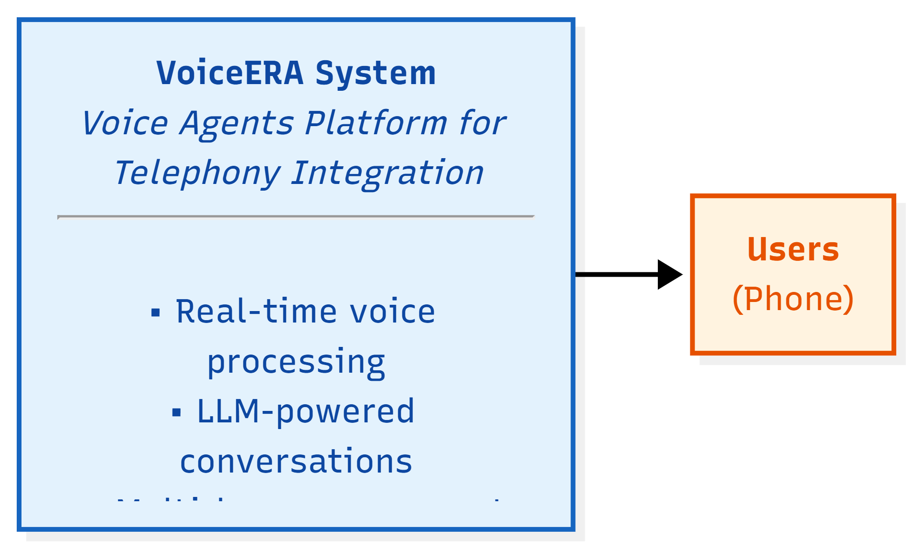
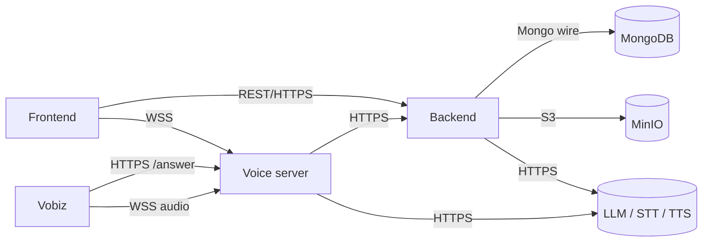

# Architecture

This page gives a high-level view of how Voicera is structured, who interacts with it, and how the major services fit together. It is aimed at architects, operators, and developers approaching the platform for the first time.


Voicera is presented here using the [C4 model](https://c4model.com/): Level 1 (System Context) shows the system as a single box surrounded by users and external systems; Level 2 (Containers) zooms in to show each deployable service.


## Level 1 — System context

The 10,000-foot view of Voicera and the actors it interacts with.



| Actor | Role |
| --- | --- |
| End user | Person who places or receives a voice call routed through Voicera. |
| Operator | Dashboard user who configures agents, links phone numbers, uploads knowledge documents, and reviews calls. |
| Telephony provider | Vobiz (or future Plivo) — provides phone numbers, rings the user, and streams audio to the voice server over WebSocket. |
| AI providers | LLM, STT, and TTS vendors (OpenAI, Anthropic, Groq, Sarvam, Deepgram, ElevenLabs, Cartesia, Bhashini, AI4Bharat, etc.). |
| Object storage | MinIO for recordings, transcripts, and uploaded PDFs. |
| Database | MongoDB for users, agents, campaigns, meetings, integrations, and knowledge document metadata. |

## Level 2 — Containers

Zooming in on the deployable units that make up Voicera.


| Container | Technology | Responsibility |
| --- | --- | --- |
| Frontend | Next.js 16, React 18, TailwindCSS 4 | Operator dashboard, agent and campaign management, browser test client. |
| Backend | FastAPI, Python 3.10+ | REST API, auth, persistence, RAG ingest, integration management, MinIO storage orchestration. |
| Voice server | Pipecat, Python 3.11+, uvloop | Real-time audio pipeline (STT → LLM → TTS), telephony webhooks, browser audio, call recording. |
| MongoDB | NoSQL | Users, agents, campaigns, meetings, integrations, knowledge document metadata. |
| MinIO | S3-compatible object store | Recordings (`.wav`/`.mp3`), transcripts (`.txt`), uploaded PDFs. |
| ChromaDB | Embedded vector store | Per-organisation vector chunks for RAG. Lives inside the backend container, persisted to disk. |
| External AI | HTTPS APIs | LLM, STT, TTS, embeddings. |


Backend and frontend are stateless and can scale horizontally. The voice server holds one WebSocket session per active call and should be scaled with sticky routing.


## Communication patterns



| Pattern | Used for |
| --- | --- |
| REST / HTTPS | Dashboard ↔ backend; voice server ↔ backend (config, KB retrieval, meeting updates). |
| WebSocket (WSS) | Telephony audio (Vobiz/Plivo), browser test audio, optional live transcript stream. |
| Service-to-service `X-API-Key` | Voice server calls into backend RAG endpoints. |

## Key design choices

| Choice | Rationale |
| --- | --- |
| Pluggable AI providers | Operators pick STT / LLM / TTS per agent. Provider keys live in **Integrations**, not in `.env`. |
| Pipeline-based voice runtime | Pipecat models the call as a frame pipeline so latency-critical stages (STT, LLM, TTS, VAD) can be swapped, tuned, and observed independently — see [voice-pipeline.md](voice-pipeline.md). |
| Per-org RAG isolation | Each organisation gets its own hashed Chroma subdirectory. Two orgs can never see each other's embeddings — see [knowledge-base-rag.md](knowledge-base-rag.md). |
| Object store for blobs | Audio, transcripts, and PDFs live in MinIO; only metadata in MongoDB. |
| Separate voice server | Telephony state and real-time audio are isolated from the CRUD backend so they can be scaled and restarted independently. |

## Deployment shape



All services run on one host via `docker-compose.yml`. Good for trials, demos, and small production deployments. See [docker-compose.md](../guides/deployment/docker-compose.md).

```
host
├── frontend         (Next.js, :3000)
├── backend          (FastAPI,  :8000)
├── voice_server     (Pipecat,  :7860)
├── mongodb          (:27017)
└── minio            (:9000, :9001)
```



Frontend and backend behind a reverse proxy (TLS), voice server behind a TLS-terminating proxy with sticky sessions, MongoDB as a replica set, MinIO as a cluster (or replaced by managed S3). See [production.md](../guides/deployment/production.md) and [security-hardening.md](../guides/deployment/security-hardening.md).



## Security boundaries

| Boundary | Mechanism |
| --- | --- |
| Dashboard ↔ backend | JWT bearer tokens, per-org RBAC. |
| Voice server ↔ backend | Shared `INTERNAL_API_KEY` over HTTPS. |
| Backend ↔ Mongo / MinIO | Auth credentials in env, network-restricted in production. |
| Telephony provider keys | Stored per-org under **Integrations**, never in repo `.env`. |
| In transit | TLS for all external API calls; WSS for browser and telephony audio. |

## Next steps

- [voice-pipeline.md](voice-pipeline.md) — how a call flows through Pipecat.
- [data-flow.md](data-flow.md) — where data lives and how it moves.
- [agents-campaigns-calls.md](agents-campaigns-calls.md) — the core data model.
- [../quickstart/install-and-run.md](../quickstart/install-and-run.md) — bring the stack up locally.
