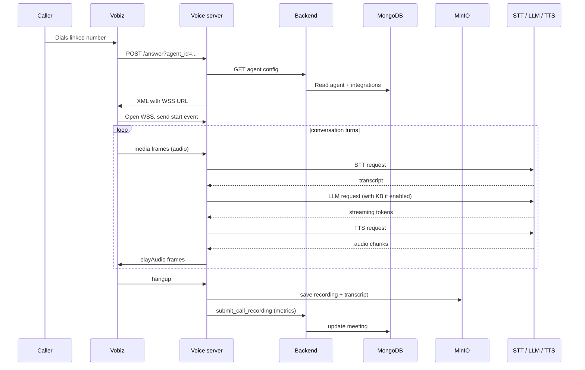
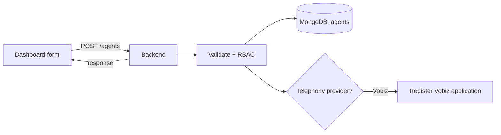
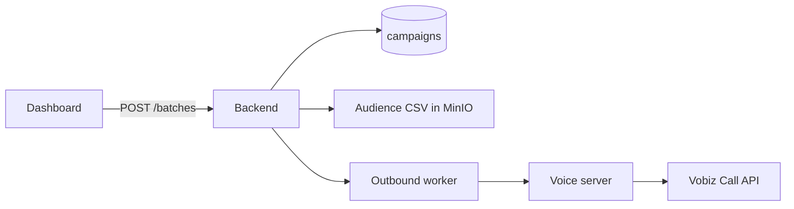
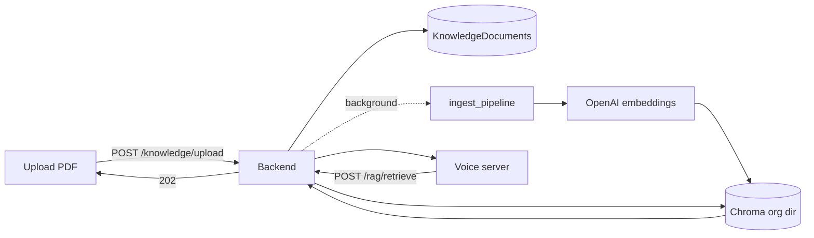
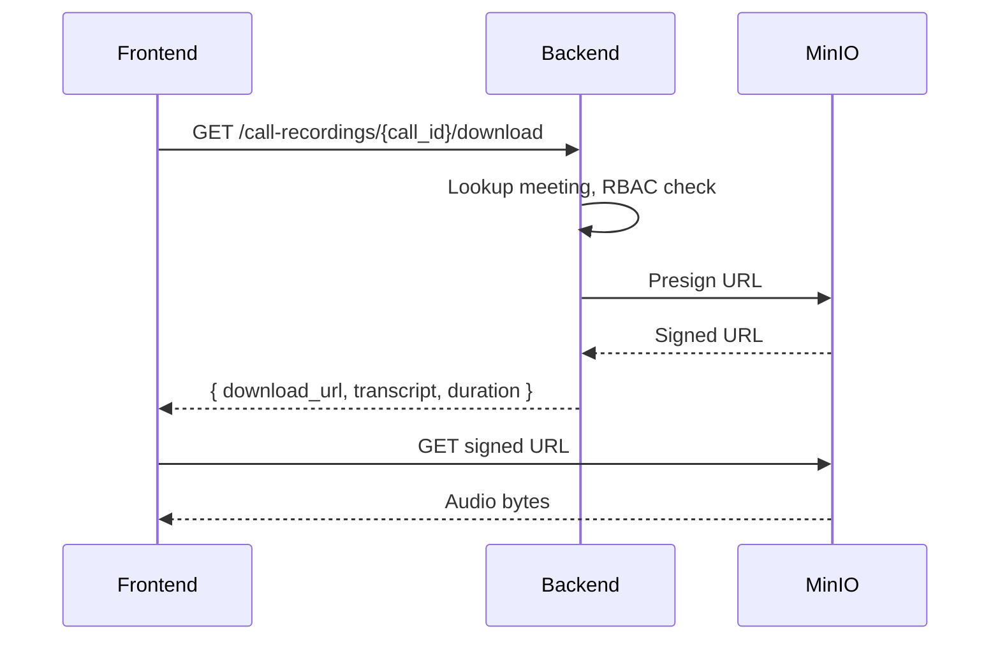
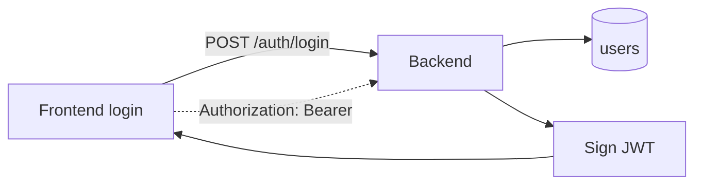

# Data flow

This page traces the main data paths in Voicera: voice calls, agent and campaign creation, recording retrieval, and analytics. It is aimed at engineers and operators who want to understand where each piece of data is produced, transformed, and stored.


Pair this page with [architecture.md](architecture.md) (where services live) and [voice-pipeline.md](voice-pipeline.md) (how the pipeline processes audio frame-by-frame).


## Storage map

| Storage | Owner | What lives there |
| --- | --- | --- |
| MongoDB | Backend | Users, agents, campaigns, meetings/call logs, integrations, KB document metadata. |
| MinIO | Backend, voice server | Recordings (`.wav` / `.mp3`), transcripts (`.txt`), uploaded PDFs. |
| ChromaDB (disk) | Backend | Per-org vector embeddings for RAG. |
| In-memory | Voice server | WebSocket session, Pipecat pipeline state, rolling LLM context. |

## Voice call data flow



| Step | Producer | Consumer | Storage write |
| --- | --- | --- | --- |
| 1. Answer webhook | Vobiz | Voice server | — |
| 2. Agent fetch | Backend | Voice server | — |
| 3. Streaming audio | Caller | STT provider | — |
| 4. Transcript | STT | LLM (and KB retriever) | — |
| 5. LLM tokens | LLM | TTS, transcript log | — |
| 6. TTS audio | TTS | Caller | — |
| 7. Post-call save | Voice server | MinIO | `recordings/<call_id>.{wav,mp3}`, `transcripts/<call_id>.txt` |
| 8. Meeting update | Voice server | Backend → MongoDB | `meetings` document with `latency_metrics`, `recording_url` |

### Wire-level structures



```json
{
  "event": "media",
  "media": {
    "contentType": "audio/x-l16",
    "sampleRate": 16000,
    "payload": "<base64 PCM>"
  },
  "streamId": "stream-uuid"
}
```



```json
{
  "model": "gpt-4o-mini",
  "messages": [
    { "role": "system", "content": "You are a helpful agent..." },
    { "role": "user",   "content": "Hello, I need help with my order" }
  ],
  "temperature": 0.7
}
```



```json
{
  "id": "call-uuid",
  "campaign_id": "campaign-uuid",
  "agent_id": "agent-uuid",
  "phone_number": "+91XXXXXXXXXX",
  "status": "completed",
  "duration_seconds": 120,
  "transcript_path": "transcripts/call-uuid.txt",
  "recording_path": "recordings/call-uuid.wav",
  "latency_metrics": {
    "avg_stt_ms": 298.1,
    "avg_llm_ttfb_ms": 512.0,
    "avg_tts_first_chunk_ms": 180.5
  },
  "created_at": "2024-05-01T10:30:00Z"
}
```



## Agent creation



| Step | What happens |
| --- | --- |
| 1 | Frontend submits agent config (LLM/STT/TTS providers, system prompt, language, KB toggles). |
| 2 | Backend validates payload and the caller's permissions. |
| 3 | Agent document written to MongoDB `agents` collection. |
| 4 | If telephony = Vobiz, backend registers a Vobiz application with answer URL `{PUBLIC_HTTPS}/answer?agent_id={id}`. |
| 5 | Agent ID returned to UI. |

## Campaign launch



| Step | What happens |
| --- | --- |
| 1 | Operator creates a campaign / batch with an `agent_id` and audience list. |
| 2 | Backend persists the campaign and stores the audience CSV in MinIO. |
| 3 | Outbound worker dequeues numbers and POSTs to the voice server `POST /outbound/call/`. |
| 4 | Voice server loads agent config, reads `telephony_provider`, fetches Vobiz auth from per-org **Integrations**, and POSTs to `{VOBIZ_API_BASE}/Account/{auth_id}/Call/`. |
| 5 | Each placed call follows the same voice call flow above. |

## Knowledge base ingest and retrieval



| Step | What happens |
| --- | --- |
| Ingest | PDF → PyMuPDF text → chunks → OpenAI `text-embedding-3-small` → Chroma collection `rag_docs` under `CHROMA_BASE_DIR/orgs/<sha256(org_id)>/`. |
| Retrieval | Voice server calls `POST /api/v1/rag/retrieve` with `org_id`, `question`, `document_ids`, `top_k`. Returns top chunks injected into the LLM context (then removed from rolling history). |

See [knowledge-base-rag.md](knowledge-base-rag.md) for the full schema.

## Recording retrieval



## Authentication



JWT payload:

```json
{
  "sub": "user-uuid",
  "email": "user@example.com",
  "role": "admin",
  "org_id": "org-uuid",
  "iat": 1674003600,
  "exp": 1674007200,
  "aud": "voicera-api"
}
```

Voice server ↔ backend uses a shared `INTERNAL_API_KEY` header instead of JWT, since calls are service-to-service.

## Failure modes

| Failure | What Voicera does |
| --- | --- |
| STT transient error | Pipecat retries via the provider client; persistent failure logs and continues, may trigger fallback prompt. |
| LLM slow response | `KenpathLLM` plays `hold_messages` after `hold_message_timeout_seconds`. Other providers stream as fast as the API permits. |
| TTS failure | Bot turn dropped; user remains in conversation, next turn retries. |
| WebSocket drop (Bhashini STT) | Service reconnects automatically. |
| KB retrieval timeout (`0.8s`) | Falls back transparently to a non-grounded LLM response. |
| `CHROMA_BASE_DIR` mismatch across containers | Retrieval returns empty; surfaced in [troubleshooting/common-issues.md](../troubleshooting/common-issues.md). |
| Voice server hard crash mid-call | Vobiz logs `HangupCause`; meeting may be marked failed; partial recording lost. |

## Summary

| Operation | Path | Storage | Typical latency |
| --- | --- | --- | --- |
| Voice turn | Audio → STT → LLM → TTS → audio | — (in-flight) | Sub-second target |
| Save call artifacts | Voice server → MinIO + backend → MongoDB | MinIO + MongoDB | Seconds after hangup |
| Create agent | UI → backend → MongoDB | MongoDB | < 200 ms |
| Launch campaign | UI → backend → worker → voice server | MongoDB + MinIO | < 500 ms to enqueue |
| Get analytics | UI → backend aggregate → MongoDB | MongoDB | < 1 s |
| Download recording | UI → backend presign → MinIO | MinIO | Depends on file size |

## Next steps

- [voice-pipeline.md](voice-pipeline.md) — Pipecat frame-by-frame detail.
- [agents-campaigns-calls.md](agents-campaigns-calls.md) — the core data model.
- [../reference/rest-api.md](../reference/rest-api.md) — REST surface for everything above.
- [../reference/websocket-api.md](../reference/websocket-api.md) — telephony and browser audio protocols.
