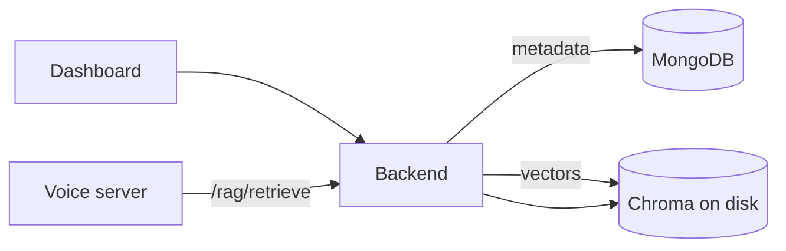
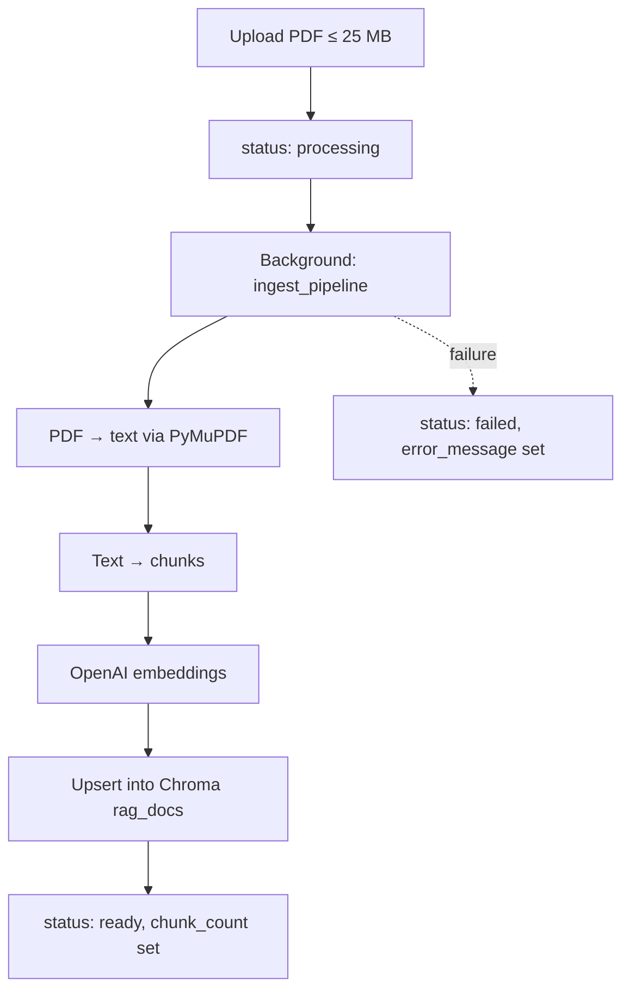
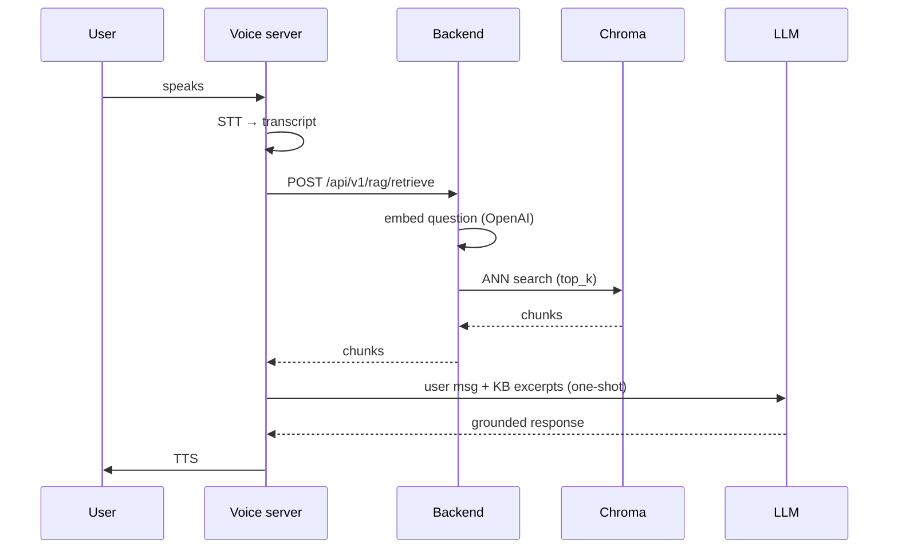

# Knowledge base and RAG

This page explains how VoicEra implements per-organisation retrieval-augmented generation (RAG): PDFs are chunked and embedded into a private vector store at upload time, and the voice server queries them mid-call to ground agent responses. It is aimed at engineers and operators configuring knowledge for agents.


Source-of-truth deep dive in the repository: [`voicera_backend/rag_system/how_rag_connects_to_the_platform.md`](https://github.com/COSS-India/voicera_mono_repository/blob/main/voicera_backend/rag_system/how_rag_connects_to_the_platform.md).


## Overview



1. Operator uploads a PDF; backend ingests it asynchronously into ChromaDB.
2. Operator enables KB on an agent and selects which documents it may search.
3. At call time, the voice server's LLM service intercepts each user turn, calls `/api/v1/rag/retrieve`, prepends the top chunks to the LLM prompt, and lets the LLM answer.


Embeddings use the **org's OpenAI Integration key** from **Dashboard → Integrations**, not a global `OPENAI_API_KEY`. Without a configured OpenAI integration, ingest will fail.


## Architecture

### Storage

| Layer | What is stored | Where |
| --- | --- | --- |
| MongoDB `KnowledgeDocuments` | Document metadata: filename, status, chunk count, errors. | Backend MongoDB. |
| ChromaDB (disk) | Vector embeddings + chunk text. | `CHROMA_BASE_DIR/orgs/<sha256(org_id)>/` |

### Isolation

Each organisation gets its own **hashed subdirectory** under `CHROMA_BASE_DIR`. Two orgs cannot see each other's vectors. The hash prevents directory-name collisions or org-ID guessing.

### Embedding model

Chunks are embedded with **OpenAI `text-embedding-3-small`**. The same model is used at ingest and at retrieval so distances are meaningful.

## Document lifecycle



| Status | Meaning |
| --- | --- |
| `processing` | Background ingest running. |
| `ready` | Embedded and queryable. |
| `failed` | Ingest failed; see `error_message`. |

## API endpoints

All routes are prefixed with `/api/v1`. Dashboard routes use JWT; the retrieval route uses a service-to-service API key.

### List documents

```http
GET /api/v1/knowledge
Authorization: Bearer <jwt>
```

```json
[
  {
    "document_id": "a1b2c3d4-...",
    "filename": "product-manual.pdf",
    "status": "ready",
    "chunk_count": 142,
    "embedding_model": "text-embedding-3-small",
    "error_message": null,
    "created_at": "2024-05-01T10:00:00Z"
  }
]
```

### Upload

```http
POST /api/v1/knowledge/upload
Content-Type: multipart/form-data
Authorization: Bearer <jwt>
```

| Field | Type | Required | Notes |
| --- | --- | --- | --- |
| `file` | PDF | yes | `.pdf` only, max **25 MB**. |
| `org_id` | string | yes | Must match the caller's organisation. |

Response is returned immediately while ingest runs in the background:

```json
{ "document_id": "a1b2c3d4-...", "filename": "product-manual.pdf", "status": "processing" }
```

### Delete

```http
DELETE /api/v1/knowledge/{document_id}
Authorization: Bearer <jwt>
```

Removes the Mongo metadata row **and** the corresponding vectors from Chroma.

| Code | Reason |
| --- | --- |
| `404` | Document not found for this org. |
| `500` | Chroma deletion failed. |

### Retrieve (service-to-service)

```http
POST /api/v1/rag/retrieve
X-API-Key: <INTERNAL_API_KEY>
Content-Type: application/json
```

```json
{
  "org_id": "org-123",
  "question": "What is the return policy?",
  "top_k": 3,
  "document_ids": ["a1b2c3d4-...", "e5f6g7h8-..."]
}
```

| Field | Type | Default | Notes |
| --- | --- | --- | --- |
| `org_id` | string | required | |
| `question` | string | required | User's utterance. |
| `top_k` | integer | `3` | Number of chunks to return. |
| `document_ids` | list[string] | optional | Filter to specific documents; omit to search all org docs. |

```json
{
  "chunks": [
    {
      "chunk_id": "a1b2c3d4-0",
      "document_id": "a1b2c3d4-...",
      "source_filename": "product-manual.pdf",
      "text": "Our return policy allows returns within 30 days...",
      "distance": 0.21
    }
  ]
}
```

## Agent configuration

Enable KB on an agent from the **Assistants** page. These fields land in the agent record:

| Field | Type | Description |
| --- | --- | --- |
| `knowledge_base_enabled` | boolean | Whether retrieval is active for this agent. |
| `knowledge_document_ids` | list[string] | Documents this agent may search. |
| `knowledge_top_k` | integer | Excerpts injected per user turn (default 3 for Groq, 10 for OpenAI). |


KB is wired up for **OpenAI** and **Groq** LLM providers via `KnowledgeBaseMixin`. Other providers fall back to a non-grounded LLM call. See [voice-pipeline.md](voice-pipeline.md#knowledge-base-integration).


## Runtime flow



### Prompt injection

The mixin rewrites the latest user message before sending it to the LLM:

```
User question:
<original user text>

Knowledge Base excerpts:
[Excerpt 1 | product-manual.pdf]
<chunk text>
...

Answer using the excerpts when relevant. If excerpts are insufficient, answer naturally.
```

After the LLM responds, the **original** user message is restored in the rolling history so KB excerpts don't accumulate across turns.

### Guardrails

| Guardrail | Behaviour |
| --- | --- |
| `knowledge_base_enabled=false` | Skip retrieval entirely. |
| Empty `knowledge_document_ids` | Skip retrieval (prevents broad org-wide searches). |
| Retrieval timeout (`0.8s`) | Fall back to a non-grounded LLM response. |
| `top_k` outside `[1, 10]` | Clamped. |

## Environment variables

| Variable | Default | Description |
| --- | --- | --- |
| `CHROMA_BASE_DIR` | `voicera_backend/rag_system/chroma_data` | Root directory for per-org Chroma stores. |
| `INTERNAL_API_KEY` | required | Shared secret for voice-server → backend calls. |


`CHROMA_BASE_DIR` must resolve to the **same path** from every process that ingests or retrieves. In Docker Compose, use a named volume or bind mount mounted identically into the backend container.


## Deployment notes

The RAG ingest pipeline runs **inside the backend container** — no separate service.

`voicera_backend/Dockerfile` installs `chromadb` and its native deps (`gcc`, `g++`, `libgomp1` on slim images). On a bind-mount deployment, Chroma data lives under `CHROMA_BASE_DIR` on the host.

```yaml
# docker-compose.yml (excerpt)
backend:
  build: ./voicera_backend
  volumes:
    - ./voicera_backend:/app
  environment:
    - CHROMA_BASE_DIR=/app/rag_system/chroma_data
    - INTERNAL_API_KEY=${INTERNAL_API_KEY}
```

## Troubleshooting

| Symptom | Likely cause | Fix |
| --- | --- | --- |
| Document stuck in `processing` | Backend crashed mid-ingest | Check backend logs; re-upload. |
| Document `failed` | Missing OpenAI integration for org | Configure OpenAI key under **Integrations**. |
| Agent ignores KB on calls | `CHROMA_BASE_DIR` mismatch across containers | Mount the same directory everywhere. |
| `500` on `/rag/retrieve` | Chroma collection not found for org | Delete and re-upload the document. |
| Upload rejected `400` | Not a PDF, or > 25 MB | Convert/compress the file. |

See [../troubleshooting/common-issues.md](../troubleshooting/common-issues.md) for more.

## Next steps

- [voice-pipeline.md](voice-pipeline.md) — how the mixin injects KB into the live pipeline.
- [agents-campaigns-calls.md](agents-campaigns-calls.md) — where KB attaches to agents.
- [../services/backend.md](../services/backend.md) — backend service reference.
- [../reference/rest-api.md](../reference/rest-api.md) — full REST surface.
