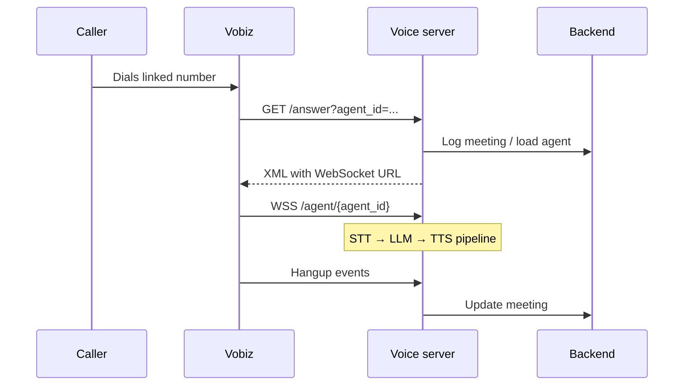
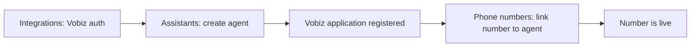

# Telephony model

This page explains how phone calls reach VoicEra, how telephony credentials are stored, and the inbound and outbound call flows. It is aimed at operators wiring up phone numbers and engineers debugging telephony.


**Vobiz Auth ID** and **Vobiz Auth Token** live in **Dashboard → Integrations**, **not** in the voice server's `.env`. The voice server loads them per organisation at call time. Documenting `.env` as the place for telephony credentials will mislead operators.


## Credentials: Integrations, not `.env`

Vobiz credentials are stored:

- **Per organisation** in the **Integrations** record.
- Persisted in MongoDB.
- Loaded at runtime by `voicera_backend/app/services/vobiz.py` (backend) and outbound flows on the voice server.

The only telephony-related env vars are **infrastructure** wiring, not secrets-per-tenant:

| Variable | Service | Purpose |
| --- | --- | --- |
| `VOBIZ_API_BASE` | Voice server | Vobiz API base URL. |
| `VOBIZ_CALLER_ID` | Voice server | Optional default outbound caller ID. |
| `JOHNAIC_SERVER_URL` | Voice server | Public HTTPS base for Vobiz webhooks. |
| `JOHNAIC_WEBSOCKET_URL` | Voice server | Public WSS base for audio. |
| `NEXT_PUBLIC_JOHNAIC_SERVER_URL` | Frontend | Used when registering Vobiz applications. |
| `VOBIZ_API_BASE_URL` | Backend | App-level Vobiz CRUD. |

See [../guides/deployment/public-voice-urls.md](../guides/deployment/public-voice-urls.md) for how to set the public URLs.

## Inbound call flow

1. Caller dials a number linked to a Vobiz **application**.
2. Vobiz fires `{PUBLIC_HTTPS_URL}/answer?agent_id=<uuid>`.
3. On `Event=StartApp`, the voice server returns XML pointing Vobiz at `{PUBLIC_WSS_URL}/agent/{agent_id}`.
4. Vobiz opens a WebSocket, sends `start`, and streams audio; the Pipecat pipeline runs (`voice_2_voice_server/api/bot.py`).
5. Hangup events update the meeting in the backend.

**Code:** `voice_2_voice_server/api/server.py` — `vobiz_answer_webhook`, `websocket_endpoint`.

## Outbound call flow

1. Trigger: `POST /outbound/call/` on the voice server (campaign worker or API client).
2. Voice server loads agent config from backend.
3. Reads `telephony_provider` (default Vobiz).
4. Loads Vobiz auth from **Integrations** for the agent's `org_id`.
5. POSTs to `{VOBIZ_API_BASE}/Account/{auth_id}/Call/`.
6. Vobiz dials the destination and, on answer, calls the same `/answer` webhook as inbound — from there the flow converges.

## Dashboard setup

1. **Integrations** — enter Vobiz Auth ID and Token.
2. **Assistants** — create an agent with `telephony_provider = Vobiz`.
3. System creates a Vobiz application with answer URL `{NEXT_PUBLIC_JOHNAIC_SERVER_URL}/answer?agent_id={id}`.
4. **Phone numbers** — link a purchased number to the agent's application.

See [../guides/operator/dashboard-tour.md](../guides/operator/dashboard-tour.md).

## WebSocket audio

| Path | Purpose |
| --- | --- |
| `WS /agent/{agent_id}` | Vobiz inbound audio and browser test. |
| `WS /plivo/agent/{agent_id}` | Plivo. |
| `WS /browser/agent/{agent_id}` | Browser test client (16 kHz L16). |

### Protocol summary

1. Vobiz opens the WebSocket; the server loads the agent config.
2. First message JSON: `{"event":"start","start":{"callSid":"...","streamSid":"..."}}`.
3. Uplink media: `event: media`, L16 PCM base64, **16 kHz** (or μ-law base64 at 8 kHz when `SAMPLE_RATE=8000`).
4. Downlink: `playAudio` frames from the server.

Full protocol: [WebSocket API](../reference/websocket-api.md).

### Encoding by sample rate

| `SAMPLE_RATE` env | Wire encoding | Content-Type |
| --- | --- | --- |
| `8000` | μ-law | `audio/x-mulaw;rate=8000` |
| `16000` | L16 (Linear PCM) | `audio/x-l16;rate=16000` |

The `VobizFrameSerializer` extends Pipecat's `PlivoFrameSerializer` to add the 16 kHz L16 path. See [voice-pipeline.md](voice-pipeline.md#serialization-vobizframeserializer).

## Call states (simplified)

| Stage | Behaviour |
| --- | --- |
| Answered | Vobiz hits `/answer`. |
| StartApp | XML + WebSocket URL returned. |
| Streaming | STT → LLM → TTS active. |
| Hangup | Meeting metadata saved. |
| User busy | `HangupCause=USER_BUSY` logged. |

## Plivo

Plivo is supported as an alternative telephony provider. Credentials follow the same **Integrations** model as Vobiz; webhooks land on `/plivo/answer` and audio streams over `/plivo/agent/{agent_id}`. Contact your hosting partner to confirm Plivo is enabled in your deployment configuration.

## Common pitfalls

| Symptom | Likely cause | Fix |
| --- | --- | --- |
| Vobiz fails to reach `/answer` | `JOHNAIC_SERVER_URL` not publicly reachable | Verify public URL; see [public-voice-urls.md](../guides/deployment/public-voice-urls.md). |
| Calls connect but no audio | WSS URL not reachable from Vobiz | Verify `JOHNAIC_WEBSOCKET_URL` and TLS terminator. |
| `INVALID_AUTH` on outbound | Vobiz Integration missing/wrong for org | Update **Integrations** for that org. |
| Garbled audio | `SAMPLE_RATE` mismatch with provider expectation | Set `SAMPLE_RATE=16000` only if Vobiz application is configured for L16. |

See [../troubleshooting/telephony.md](../troubleshooting/telephony.md) for more.

## Next steps

- [voice-pipeline.md](voice-pipeline.md) — what runs once the WebSocket is open.
- [agents-campaigns-calls.md](agents-campaigns-calls.md) — agent and phone-number linking model.
- [../services/integrations.md](../services/integrations.md) — Integrations service reference.
- [../guides/deployment/public-voice-urls.md](../guides/deployment/public-voice-urls.md) — exposing the voice server publicly.
