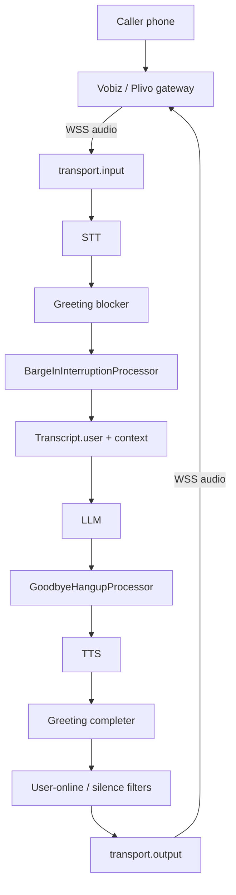

# Voice pipeline

This page explains the real-time runtime behind every Voicera call: the Pipecat pipeline that converts inbound audio into transcripts, LLM responses, and synthesized speech. It is aimed at engineers extending the voice server or debugging call quality.


[Pipecat](https://github.com/pipecat-ai/pipecat) is an async Python framework for voice AI. It models a call as typed `Frame` objects flowing through an ordered list of `FrameProcessor` stages.


## Core concepts

| Concept | What it is |
| --- | --- |
| `Frame` | The atomic unit of data: audio chunk, transcript, LLM token, TTS marker, control signal. |
| `FrameProcessor` | One pipeline stage. Receives frames via `process_frame`, pushes via `push_frame`. Direction is `DOWNSTREAM` or `UPSTREAM`. |
| `Pipeline` | Ordered list of processors; frames flow left → right by default. |
| `PipelineTask` | Wraps a pipeline with runtime params (`allow_interruptions`, `enable_metrics`) and observers. |
| `PipelineRunner` | Drives the asyncio event loop for one call until `EndFrame` or `CancelFrame`. |

### Frame types used in Voicera

| Frame | Direction | Meaning |
| --- | --- | --- |
| `InputAudioRawFrame` | ↓ | PCM audio from caller |
| `AudioRawFrame` | ↓ | PCM audio to play to caller |
| `TranscriptionFrame` / `InterimTranscriptionFrame` | ↓ | Final / partial STT result |
| `LLMTextFrame` | ↓ | One LLM output token |
| `LLMFullResponseStartFrame` / `LLMFullResponseEndFrame` | ↓ | LLM turn boundaries |
| `TTSSpeakFrame` | ↑ or ↓ | Queue text for TTS |
| `TTSStartedFrame` / `TTSStoppedFrame` | ↓ | TTS synthesis boundaries |
| `UserStartedSpeakingFrame` / `UserStoppedSpeakingFrame` | ↓ | VAD events |
| `BotStartedSpeakingFrame` / `BotStoppedSpeakingFrame` | ↓ | Bot playback events |
| `InterruptionFrame` / `StartInterruptionFrame` | ↓ | Trigger barge-in |
| `MetricsFrame` | ↓ | Latency data (TTFB, processing time) |
| `EndFrame` / `CancelFrame` | ↓ | Graceful stop / immediate abort |

## Pipeline in Voicera

Defined in `voice_2_voice_server/api/bot.py` — `run_bot()`.

```python
pipeline_processors = [
    transport.input(),               # 1.  WebSocket → audio frames
    stt,                             # 2.  Audio → TranscriptionFrame
    greeting_blocker,                # 3.  Block interruptions during greeting
    BargeInInterruptionProcessor(),  # 4.  Gate barge-in (VAD + word count)
    transcript.user(),               # 5.  Record user turn
    context_aggregator.user(),       # 6.  Append user text to LLM context
    llm,                             # 7.  Stream LLM tokens
    goodbye_processor,               # 8.  Detect farewell → schedule hangup
    tts,                             # 9.  LLM text → AudioRawFrame
    greeting_completer,              # 10. Unblock interruptions after greeting
    user_online_detection_filter,    # 11. Prompt if user silent (optional)
    user_silence_hangup_filter,      # 12. Hang up on silence (optional)
    transcript.assistant(),          # 13. Record bot turn
    audiobuffer,                     # 14. Buffer audio for recording (non-Vobiz)
    transport.output(),              # 15. Audio frames → WebSocket
    context_aggregator.assistant(),  # 16. Append bot reply to LLM context
]
```



## Transport layer

`FastAPIWebsocketTransport` bridges the FastAPI WebSocket to the pipeline.

```python
transport = FastAPIWebsocketTransport(
    websocket=websocket_client,
    params=FastAPIWebsocketParams(
        audio_in_enabled=True,
        audio_out_enabled=True,
        add_wav_header=False,
        vad_analyzer=vad_analyzer,        # Silero
        serializer=serializer,            # VobizFrameSerializer
        audio_in_passthrough=True,
        session_timeout=session_timeout,
        audio_out_10ms_chunks=2,          # 20 ms output chunks
    ),
)
```

| Endpoint | Provider | Notes |
| --- | --- | --- |
| `WS /agent/{agent_id}` | Vobiz | Primary. Receives `start` event then audio. |
| `WS /plivo/agent/{agent_id}` | Plivo | Uses `parse_telephony_websocket` for handshake. |
| `WS /browser/agent/{agent_id}` | Browser | 16 kHz L16; emits live `transcript` events back. |

### Call setup sequence

1. Caller dials → Vobiz fires `POST /answer?agent_id=X`.
2. Server returns XML pointing Vobiz at `/agent/{agent_id}`.
3. Vobiz opens the WebSocket and sends `{"event":"start","start":{"callId":"...","streamId":"..."}}`.
4. Server extracts `call_sid` / `stream_sid` and calls `bot()`.
5. `bot()` creates transport, serializer, and VAD; `run_bot()` assembles the pipeline.
6. `on_client_connected` fires → starts recording + queues `TTSSpeakFrame(greeting)`.


**TCP_NODELAY** is applied to every WebSocket socket via a subclassed `WebSocketProtocol`. This removes Nagle's ~40 ms batching delay on small audio packets.


## Services

All services are created in `voice_2_voice_server/api/services.py` via three factories.



| Provider | Class | Notes |
| --- | --- | --- |
| `OpenAI` | `OpenAIKnowledgeLLMService` | KB-capable. Org integration key. |
| `Kenpath` | `KenpathLLM` | Indian govt LLM (Vistaar). JWT auth, hold messages, Bhashini fast-turn. |
| `Anthropic` | `AnthropicLLMService` | Org key. Supports `enable_prompt_caching`. |
| `Grok` | `GrokLLMService` | `XAI_API_KEY` or org key. |
| `Groq` | `GroqKnowledgeLLMService` | KB-capable. Org key. |
| `qwen` / `localqwen` / `vllm` | `VllmQwenVoiceLLMService` | Self-hosted vLLM. `enable_thinking=False`. |

All non-Kenpath providers use `aggregation_timeout=0.05s` via `LLMUserAggregatorParams`.



| Provider | Class | Notes |
| --- | --- | --- |
| `Deepgram` | `DeepgramSTTService` | Streaming WS. `interim_results=True`, `endpointing=150ms`. |
| `Google` | `GoogleSTTService` | Service account JSON. |
| `OpenAI` | `OpenAISTTService` | Whisper, REST. |
| `Sarvam` | `SarvamSTTService` | Indian languages. Default `saarika:v2.5`. |
| `ElevenLabs` | `ElevenLabsRealtimeSTTService` | `scribe_v2_realtime` for streaming. |
| `AI4Bharat` | `IndicConformerRESTSTTService` | Local Indic ASR, forces `sample_rate=16000`. |
| `Bhashini` | `BhashiniSTTService` | gRPC. Custom VAD. `service_id="bhashini/ai4b/indic-conformer/grpc"`. |



| Provider | Class | Notes |
| --- | --- | --- |
| `Cartesia` | `CartesiaTTSService` | Encoding `pcm_s16le`. |
| `ElevenLabs` | `ElevenLabsTTSService` | Requires `voice_id`. |
| `Google` | `GoogleTTSService` | Service account. |
| `OpenAI` | `OpenAITTSService` | Voice via `voice` / `voice_id`. |
| `Sarvam` | `SarvamTTSService` | Default `bulbul:v3` (ignores `pitch`/`loudness`). |
| `AI4Bharat` | `IndicParlerRESTTTSService` | Local Indic TTS, `indic-parler-tts`. |
| `Bhashini` | `BhashiniTTSService` | gRPC. Fixed `sample_rate=44100`. |
| `Deepgram` | `DeepgramTTSService` | Aura-2; short names → `aura-2-{name}-en`. |



### Custom services worth knowing

- **KenpathLLM** (`services/kenpath_llm/llm.py`) — extends `OpenAILLMService` with JWT rotation, `hold_messages` (interim phrases during slow LLM), `response_timeout` (default `0.3s`), and `enable_bhashini_fast_turn()` for Bhashini STT pairing.
- **IndicConformerRESTSTTService** (`services/ai4bharat/stt.py`) — REST client for AI4Bharat. Resamples to 16 kHz and consults the external `vad_analyzer` to flush audio.
- **BhashiniSTTService** (`services/bhashini/stt.py`, ~654 lines) — WebSocket streaming client. `suppress_vad_frames=True` when external Silero is present; reconnects on drop.
- **FastPunctuationAggregator** (`utils/bot_utils.py:116`) — replaces Pipecat's NLTK sentence aggregator. Emits TTS chunks immediately on `.!?,`, removing 50–150 ms of latency.

## Custom frame processors

### BargeInInterruptionProcessor

`utils/bot_utils.py:148`. Three-layer barge-in filter:

| Layer | Mechanism | Blocks |
| --- | --- | --- |
| 1 | Silero VAD confidence | Non-speech audio (coughs score 0.1–0.3, speech 0.8–1.0). |
| 2 | `_user_speaking` flag | Only armed after `UserStartedSpeakingFrame` clears layer 1. |
| 3 | Minimum word count | Requires `min_words` (default 1) before emitting `InterruptionFrame`. |

`min_words` comes from `agent_config.interruption_min_words`.

### GreetingInterruptionFilter

`utils/audio/greeting_interruption_filter.py`. Two cooperating instances share one `GreetingGuard` state:

- **blocker** (pos 3): drops `UserStartedSpeakingFrame`, `InterruptionFrame`, `StartInterruptionFrame` while greeting is in progress.
- **completer** (pos 10): clears `guard.in_progress` on `TTSStoppedFrame`.

Activated when `ignore_user_speech_before_greeting=true` (default).

### GoodbyeHangupProcessor

`utils/call_goodbye.py`. Regex-scans LLM responses for farewell phrases (`goodbye`, `bye bye`, `end of conversation`, `take care`, `farewell`, `signing off`, `have a good day`, `that's all for now`, …). On match: sets `_ending=True` and `_suppress_idle=True`. On next `BotStoppedSpeakingFrame`: `schedule_call_end()` → `task.stop_when_done()`.

### UserOnlineDetectionFilter

`utils/audio/user_online_detection_filter.py`. After `BotStoppedSpeakingFrame`, starts an `asyncio.sleep(timeout_secs)`. On timeout, sends `TTSSpeakFrame(prompt_text)` **upstream** so it reaches TTS. Reset by `UserStartedSpeakingFrame` or `BotStartedSpeakingFrame`. Configured via `user_online_detection_enabled`, `user_online_detection_message`, `user_online_detection_seconds` (default `10.0`).

### UserSilenceHangupProcessor

`utils/call_management/user_silence_hangup.py`. Same timer pattern, but calls `schedule_call_end()` instead of replaying a prompt. Activated via `user_silence_hangup_seconds > 0` (default `0` = disabled).

## VAD (Silero)

`pipecat.audio.vad.silero.SileroVADAnalyzer` — a neural ONNX VAD classifying 30 ms windows.



Bhashini does its own STT-level VAD, so transport VAD is tuned conservatively:

```python
VADParams(
    stop_secs=0.2,
    min_volume=0.6,
    confidence=0.7,
    start_secs=0.2,
)
vad_analyzer._smoothing_factor = 0.15
```



```python
VADParams(
    stop_secs=0.4,
    min_volume=0.4,
    confidence=0.3,
    start_secs=0.1,
)
vad_analyzer._smoothing_factor = 0.1
```

Lower confidence (`0.3`) catches speech earlier; longer `stop_secs` (`0.4`) avoids cutting off mid-sentence.



Two Pipecat constants are monkey-patched per call:

```python
pipecat.transports.base_input.AUDIO_INPUT_TIMEOUT_SECS = 0.1   # default 0.5
pipecat.transports.base_output.BOT_VAD_STOP_SECS = 0.2         # default 0.5
```

## Serialization: VobizFrameSerializer

`voice_2_voice_server/serializer/vobiz_serializer.py`. Extends `PlivoFrameSerializer`. Vobiz is Plivo-protocol-compatible; the subclass adds 16 kHz L16 because μ-law is 8 kHz only.

| `SAMPLE_RATE` env | Wire encoding | Content-Type |
| --- | --- | --- |
| `8000` (default) | μ-law | `audio/x-mulaw;rate=8000` |
| `16000` | L16 (Linear PCM) | `audio/x-l16;rate=16000` |

```python
# Serialize (output → WS)
return json.dumps({
    "event": "playAudio",
    "media": {"contentType": "audio/x-l16", "sampleRate": 16000, "payload": b64},
    "streamId": self._stream_id,
})
```

## Metrics

`CallMetricsObserver` (`utils/metrics/call_metrics_observer.py`) implements `BaseObserver`. It sees every frame passively without affecting flow.

| Field | Source | Meaning |
| --- | --- | --- |
| `stt_ms` | `ProcessingMetricsData` (STT) | Transcription time. |
| `llm_ttfb_ms` | `TTFBMetricsData` (LLM) | Time to first LLM token. |
| `tts_first_chunk_ms` | `TTFBMetricsData` (TTS) | Time to first audio chunk. |
| `user_text_preview` | `TranscriptionFrame` | First 80 chars of user utterance. |

Metrics emit only when `PipelineTask(params=PipelineParams(enable_metrics=True), observers=[metrics_observer])`. They are submitted post-call via `submit_call_recording()` alongside transcript and recording URL.

## Knowledge base integration

`KnowledgeBaseMixin` (in `services/openai_kb_llm.py`) is mixed into `OpenAILLMService` and `GroqLLMService`:

```python
class OpenAIKnowledgeLLMService(KnowledgeBaseMixin, OpenAILLMService): ...
class GroqKnowledgeLLMService(KnowledgeBaseMixin, GroqLLMService): ...
```

`_process_context()` intercepts the LLM call: finds the latest `user` message, calls `fetch_knowledge_chunks(org_id, question, document_ids, top_k, timeout=0.8s)` via `asyncio.to_thread`, prepends retrieved excerpts to the user message, lets the LLM respond, then **restores the original user message** so KB context does not pollute the rolling history.

Guardrails: activates only when `knowledge_base_enabled=true` AND `knowledge_document_ids` is non-empty; `top_k` clamped to `[1, 10]` (default 10 for OpenAI, 3 for Groq); 0.8 s retrieval timeout falls back to a natural response. See [knowledge-base-rag.md](knowledge-base-rag.md).

## Performance optimisations

| # | Optimisation | Impact |
| --- | --- | --- |
| 1 | `SOXRStreamAudioResampler` patched from `"VHQ"` to `"QQ"` | Removes ~200 ms resampler latency. |
| 2 | `patch_immediate_first_chunk()` | First audio chunk bypasses queue (~20–40 ms saved). |
| 3 | `audio_out_10ms_chunks=2` | 20 ms output chunks instead of 40 ms. |
| 4 | `AUDIO_INPUT_TIMEOUT_SECS=0.1`, `BOT_VAD_STOP_SECS=0.2` | Faster barge-in. |
| 5 | `FastPunctuationAggregator` | Saves 50–150 ms vs NLTK. |
| 6 | `TCP_NODELAY` on every WebSocket | Removes Nagle batching. |
| 7 | `aggregation_timeout=0.05s` | Tighter LLM kickoff after user stops. |

## Call lifecycle

```
1. RING        Vobiz/Plivo fires POST /answer?agent_id=X
2. HANDSHAKE   XML response → WebSocket opens
3. SETUP       Agent config fetched; serializer, VAD, transport built; perf patches applied
4. BUILD       LLM/STT/TTS factories; pipeline assembled; PipelineTask + observer; runner
5. GREETING    on_client_connected: start recording; queue TTSSpeakFrame(greeting)
6. LOOP        User → VAD → STT → context → LLM → TTS → audio out (until End/Cancel)
7. HANGUP      Goodbye | session timeout | silence | client disconnect
8. POST-CALL   Save MP3/WAV + transcript to MinIO; POST submit_call_recording with metrics
```

## Configuration reference

### Environment variables (voice server)

| Variable | Default | Purpose |
| --- | --- | --- |
| `SAMPLE_RATE` | `8000` | `8000` = μ-law, `16000` = L16 PCM. |
| `JOHNAIC_SERVER_URL` | — | Public HTTPS URL of voice server. |
| `JOHNAIC_WEBSOCKET_URL` | — | Public WSS URL. |
| `VOBIZ_API_BASE` | — | Vobiz REST base URL. |
| `VOBIZ_CALLER_ID` | — | Default outbound caller ID. |
| `OPENAI_API_KEY` | — | Fallback; org Integration takes priority. |
| `DEEPGRAM_API_KEY` | — | Fallback Deepgram key. |
| `SARVAM_API_KEY` | — | Fallback Sarvam key. |
| `ELEVENLABS_API_KEY` | — | Fallback ElevenLabs key. |
| `XAI_API_KEY` | — | Grok key. |
| `BHASHINI_API_KEY` | — | Bhashini STT key. |
| `VLLM_API_KEY`, `VLLM_BASE_URL` | — | vLLM server. |
| `GOOGLE_STT_CREDENTIALS_PATH` | `credentials/google_stt.json` | Google STT account. |
| `GOOGLE_TTS_CREDENTIALS_PATH` | `credentials/google_tts.json` | Google TTS account. |

See [../reference/environment-variables.md](../reference/environment-variables.md) for the complete list.

### Agent config fields (pipeline-relevant)

| Field | Type | Default | Effect |
| --- | --- | --- | --- |
| `system_prompt` | string | — | LLM system message. |
| `greeting_message` | string | — | Queued as first `TTSSpeakFrame`. |
| `ignore_user_speech_before_greeting` | bool | `true` | Block barge-in during greeting. |
| `interruption_min_words` | int | `1` | Words needed to trigger barge-in. |
| `call_timeout_seconds` | int | `600` | Max call duration. |
| `hold_messages` | list[str] | `[]` | Phrases while waiting for slow LLM. |
| `hold_message_timeout_seconds` | float | `0.3` | Trigger threshold. |
| `user_online_detection_enabled` | bool | `false` | Silence-prompt timer. |
| `user_online_detection_message` | string | — | Prompt text. |
| `user_online_detection_seconds` | float | `10.0` | Silence duration. |
| `user_silence_hangup_seconds` | int | `0` | Hangup after silence (0 = off). |
| `knowledge_base_enabled` | bool | `false` | Enable KB RAG. |
| `knowledge_document_ids` | list[str] | `[]` | KB doc UUIDs. |
| `knowledge_top_k` | int | `10` | Max excerpts per turn. |
| `language` | string | — | Propagated to STT + TTS. |

## Adding a new provider


Position matters. A processor inserted before STT will not see transcripts; one inserted after TTS cannot block audio output.


- **STT** — create `services/<name>/stt.py` extending `STTService`; implement `run()` and `stop()`. Register in `config/stt_mappings.py`. Add `elif provider == "Name":` branch in `create_stt_service()`.
- **TTS** — create `services/<name>/tts.py` extending `TTSService`; implement `run_tts(text)` as async generator yielding `AudioRawFrame`. Register in `config/tts_mappings.py`. Add to `create_tts_service()`.
- **LLM** — reuse a Pipecat built-in or extend `OpenAILLMService` for OpenAI-compatible providers. Register aliases in `config/llm_mappings.py`. Add to `create_llm_service()` with org-scoped key via `fetch_integration_key()` if needed.
- **Frame processor** — extend `FrameProcessor`, override `process_frame(frame, direction)`, always `await super().process_frame(...)` first, and `await self.push_frame(...)` to pass frames downstream. Insert into `pipeline_processors` at the correct position.

## Next steps

- [data-flow.md](data-flow.md) — where call data ends up.
- [knowledge-base-rag.md](knowledge-base-rag.md) — KB retrieval at call time.
- [telephony-model.md](telephony-model.md) — Vobiz answer/WebSocket handshake.
- [../services/voice-server.md](../services/voice-server.md) — voice server service reference.
