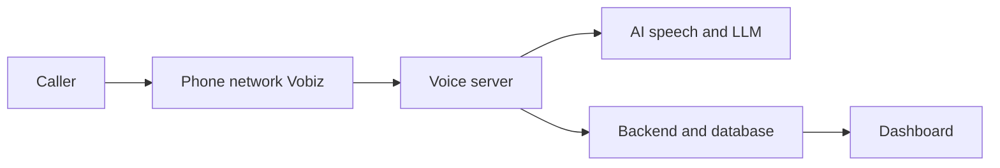

# VoicERA overview (plain language)

This page is for programme managers, district IT officers, and operators who do not need Docker or Python details. For technical setup, see [Prerequisites](prerequisites.md) and [Deployment walkthrough](deployment-walkthrough.md).

## In one sentence

VoicERA is a platform to run **AI phone agents** that can answer or make phone calls in Indian languages, with a **web dashboard** to configure agents and view call history and recordings.

## What problem it solves

Government departments and partners need phone lines that can:

- Answer many calls automatically in local languages
- Follow a script or a [knowledge base](../services/knowledge-base.md)
- Log who called and what was said
- Optionally place outbound calls (campaigns)

VoicERA provides the software stack. A **telephony provider** (typically **Vobiz**) connects real phone numbers to the system.

## Main parts

| Part | What it does | Analogy |
|------|--------------|---------|
| **Dashboard** | Create agents, link phone numbers, view calls | Control panel |
| **Backend** | Saves users, agents, call history | Filing cabinet and rules |
| **Voice server** | Handles the live conversation on each call | The AI on the phone |
| **MongoDB** | Stores settings and records | Filing cabinet storage |
| **MinIO** | Stores recordings and uploaded files | Audio and file archive |
| **Speech servers** (optional) | Speech↔text on your own servers | In-house interpreter machines |

## How a phone call works

1. Someone dials your number (or receives an outbound call).
2. The **phone company** (Vobiz) connects the call to your **voice server** over the internet.
3. The voice server **listens** (speech-to-text), **decides what to say** (AI), and **speaks** (text-to-speech).
4. Call details are saved and appear in the **dashboard**.
5. Recordings (if enabled) are stored in **MinIO**.

## What is an "agent"?

An **agent** is **not** a human employee. It is a **configured virtual call handler**: language, AI voice and brain (STT/TTS/LLM), instructions (system prompt), and which phone number(s) use this configuration. One deployment can have many agents (for example a Hindi helpline and a Marathi survey).

## How parts connect

## Staff vs hosting partner

| Staff (operators) | Hosting partner (technical) |
|-------------------|----------------------------|
| Log into dashboard | Install server, Docker, HTTPS |
| Create agents | Set environment URLs |
| Enter API keys in **Integrations** | Start/stop services, backups |
| Link phone numbers | Firewall, DNS, logs |

!!! important "Telephony credentials"
    **Vobiz Auth ID and Auth Token** are entered in **Dashboard → Integrations**, not in server `.env` files for normal operation. See [Integrations](../services/integrations.md) and [Telephony](../services/telephony.md).

## Related documentation

- [Prerequisites checklist](prerequisites.md)
- [Glossary](glossary.md)
- [Telephony (Vobiz)](../services/telephony.md)
