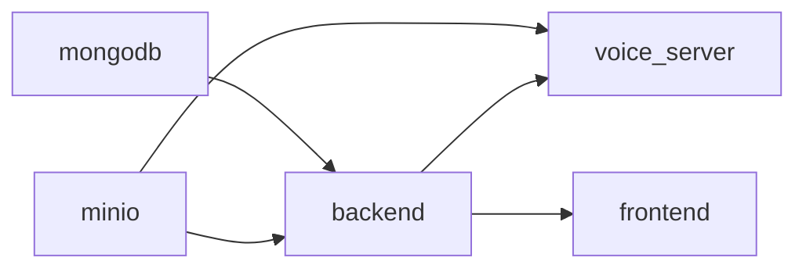

# Docker Compose deployment

VoicEra ships as five containers orchestrated by `docker-compose.yml` at the repository root. This page is for hosting partners and operators who run the standard packaged stack on a single Linux host.

## Service inventory

| Container | Image / build context | Host port | Purpose |
|-----------|----------------------|-----------|---------|
| `voicera_mongodb` | `mongo:latest` | `27017` | Persistent store for tenants, agents, call logs |
| `voicera_minio` | `minio/minio:latest` | `9000` (API), `9001` (console) | Object storage for recordings, transcripts, uploads |
| `voicera_backend` | `./voicera_backend` | `8000` | FastAPI orchestrator |
| `voicera_voice_server` | `./voice_2_voice_server` | `7860` | Pipecat voice pipeline and telephony webhooks |
| `voicera_frontend` | `./voicera_frontend` | `3000` | Next.js dashboard |
| `voicera_nginx` | `nginx:alpine` | `8080` | Optional local reverse proxy (dev convenience) |

Optional AI4Bharat speech containers expose `8001` (STT) and `8002` (TTS) when enabled. See [AI4Bharat STT](../../services/ai4bharat-stt.md) and [AI4Bharat TTS](../../services/ai4bharat-tts.md).

## Prerequisites

- Docker 20.10+ and Docker Compose v2
- 8 GB RAM minimum (16 GB recommended)
- 50 GB disk for images, volumes, and recordings
- Cloned `voicera_mono_repository` with `.env` files prepared

If anything above is missing, finish the [Prerequisites](../../quickstart/prerequisites.md) checklist first.

## Build and start

The Makefile is the supported entry point. It wraps `docker compose` with the right flags and load order.

```bash
# Build all images
make build-all-services

# Start the full stack in the background
make start-all-services

# Stop everything
make stop-all-services

# Force-release host ports if a stale process holds them
make stop-all-ports
```

Equivalent direct commands:

```bash
docker compose build
docker compose up -d
docker compose down
```

## Startup order

`depends_on` with health checks enforces this order:



Use `docker compose ps` to confirm services come up healthy. The backend will not start until MongoDB and MinIO report `healthy`.

## Environment files

Each service reads its own `.env`. The compose file mounts them via `env_file`:

```bash
cp voicera_backend/env.example          voicera_backend/.env
cp voice_2_voice_server/.env.example    voice_2_voice_server/.env
cp voicera_frontend/.env.example        voicera_frontend/.env.local
```

Edit each file with non-default secrets and the public voice URLs before going live. See [Environment variables](../../reference/environment-variables.md) and [Public voice server URLs](public-voice-urls.md).

## Managing the stack



```bash
# All services
docker compose logs

# One service, follow
docker compose logs -f backend

# Last 100 lines
docker compose logs --tail 100 voice_server
```



```bash
# Backend Python shell
docker compose exec backend bash

# MongoDB shell
docker compose exec mongodb mongosh \
  --username admin --password admin123

# MinIO client inside the container
docker compose exec minio mc alias set local http://localhost:9000 minioadmin minioadmin
```



```bash
# Restart all services
docker compose restart

# Restart one
docker compose restart backend

# Hard cycle
docker compose down && docker compose up -d
```



## Networking

All containers share the `voicera_network` bridge and resolve each other by service name:

| Source | Destination | URL inside the network |
|--------|-------------|------------------------|
| Backend | MongoDB | `mongodb:27017` |
| Backend | MinIO | `minio:9000` |
| Voice server | Backend | `backend:8000` |
| Frontend | Backend | `backend:8000` |
| Frontend | Voice server | `voice_server:7860` |

Host port publishing (left side of `ports:`) is what you expose to the outside world. In production keep MongoDB (27017), MinIO (9000, 9001), and the backend (8000) off the public internet and front the stack with a reverse proxy.

## Volumes and data

Two named volumes hold all persistent state:

```yaml
volumes:
  mongodb_data:   # MongoDB data files
  minio_data:     # Recordings, transcripts, uploads
```

```bash
# List
docker volume ls | grep voicera

# Backup MongoDB
docker compose exec mongodb mongodump \
  --username admin --password admin123 \
  --out /tmp/backup
docker cp voicera_mongodb:/tmp/backup ./mongodb_backup

# Mirror MinIO to disk
docker compose exec minio mc mirror local/recordings /tmp/minio-backup
```


`docker compose down -v` deletes both volumes and erases all tenant data, recordings, and uploads. Never run it on a live deployment.


## Scaling on a single host

Stateless services (frontend, backend, voice server) can run multiple replicas behind a load balancer:

```bash
docker compose up -d --scale backend=3
```

Sticky sessions on the voice server are not required for inbound calls because each call establishes a new WebSocket, but a load balancer with WebSocket support (nginx, Traefik, cloud LB) is needed.

## Troubleshooting

| Symptom | First check |
|---------|-------------|
| Container restarts in a loop | `docker compose logs <service>` for stack traces |
| Port already in use | `lsof -i :<port>` and `make stop-all-ports` |
| Backend cannot reach MongoDB | Confirm `MONGODB_HOST=mongodb` and the health check is green |
| Voice webhook timeouts | Verify `JOHNAIC_SERVER_URL` and that port 443 reaches the host |

More remedies live in [Troubleshooting: deployment](../../troubleshooting/deployment.md).

## Next steps

- [Deployment walkthrough](deployment-walkthrough.md)
- [Production deployment](production.md)
- [Security hardening](security-hardening.md)
- [Public voice server URLs](public-voice-urls.md)
