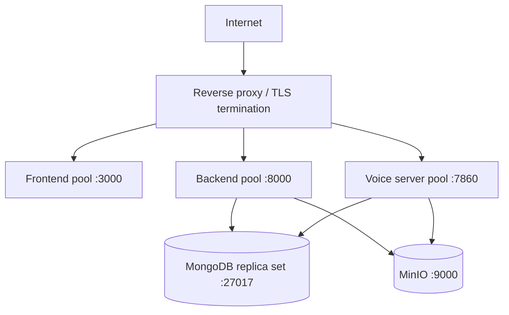

# Production deployment

This guide moves a working VoicEra stack from a single-host demo into a hardened production deployment. It assumes the [Docker Compose](docker-compose.md) layout and adds capacity sizing, reverse proxy, durability, and monitoring.

For step-by-step go-live instructions read [Deployment walkthrough](deployment-walkthrough.md) first, then return here to harden the result.

## Pre-deployment checklist

- [ ] All `.env` files contain non-default secrets
- [ ] `JOHNAIC_SERVER_URL` and `JOHNAIC_WEBSOCKET_URL` point at public DNS
- [ ] TLS certificates issued for dashboard, API, and voice domains
- [ ] MongoDB and MinIO are not exposed on the public internet
- [ ] Daily backup job for MongoDB and MinIO is scheduled and tested
- [ ] Monitoring and log aggregation are in place
- [ ] Disaster recovery runbook exists
- [ ] [Security hardening](security-hardening.md) checklist completed

## Capacity sizing

| Profile | CPU | RAM | Disk | Notes |
|---------|-----|-----|------|-------|
| Minimum | 4 cores | 16 GB | 200 GB SSD | Light pilot, no local AI4Bharat |
| Recommended | 8+ cores | 32 GB+ | 500 GB+ SSD | Several concurrent calls, recordings |
| Indic local STT/TTS | + NVIDIA GPU | + 16 GB VRAM | + model storage | Required for `indic-conformer-stt` / `indic-parler-tts` |

Plan disk capacity around recording retention: WAV recordings average a few hundred KB per minute and accumulate in MinIO.

## Reference architecture



Keep MongoDB (`27017`), MinIO API (`9000`), and MinIO console (`9001`) on a private network. Only `443` reaches the load balancer.

## TLS termination with nginx

Issue certificates with Let's Encrypt or your enterprise CA:

```bash
sudo certbot certonly --standalone \
  -d app.example.gov.in \
  -d api.example.gov.in \
  -d voice.example.gov.in
```

A minimal production-grade reverse proxy:

```nginx
# /etc/nginx/sites-enabled/voicera.conf

server {
    listen 80;
    server_name app.example.gov.in api.example.gov.in voice.example.gov.in;
    return 301 https://$server_name$request_uri;
}

# Dashboard
server {
    listen 443 ssl http2;
    server_name app.example.gov.in;

    ssl_certificate     /etc/letsencrypt/live/app.example.gov.in/fullchain.pem;
    ssl_certificate_key /etc/letsencrypt/live/app.example.gov.in/privkey.pem;
    ssl_protocols       TLSv1.2 TLSv1.3;
    ssl_ciphers         HIGH:!aNULL:!MD5;

    location / {
        proxy_pass http://frontend:3000;
        proxy_set_header Host $host;
        proxy_set_header X-Real-IP $remote_addr;
        proxy_set_header X-Forwarded-For  $proxy_add_x_forwarded_for;
        proxy_set_header X-Forwarded-Proto $scheme;
    }
}

# Backend API
server {
    listen 443 ssl http2;
    server_name api.example.gov.in;

    ssl_certificate     /etc/letsencrypt/live/api.example.gov.in/fullchain.pem;
    ssl_certificate_key /etc/letsencrypt/live/api.example.gov.in/privkey.pem;

    limit_req_zone $binary_remote_addr zone=api_limit:10m rate=100r/s;
    limit_req zone=api_limit burst=200;

    location / {
        proxy_pass http://backend:8000;
        proxy_http_version 1.1;
        proxy_set_header Host $host;
        proxy_set_header X-Real-IP $remote_addr;
        proxy_set_header X-Forwarded-For  $proxy_add_x_forwarded_for;
        proxy_set_header X-Forwarded-Proto $scheme;
        proxy_set_header Upgrade $http_upgrade;
        proxy_set_header Connection "upgrade";
    }
}

# Voice server with WebSocket
upstream voice_servers {
    least_conn;
    server voice_server_1:7860;
    server voice_server_2:7860;
}

server {
    listen 443 ssl http2;
    server_name voice.example.gov.in;

    ssl_certificate     /etc/letsencrypt/live/voice.example.gov.in/fullchain.pem;
    ssl_certificate_key /etc/letsencrypt/live/voice.example.gov.in/privkey.pem;

    location / {
        proxy_pass http://voice_servers;
        proxy_http_version 1.1;
        proxy_set_header Upgrade $http_upgrade;
        proxy_set_header Connection "upgrade";
        proxy_set_header Host $host;
        proxy_set_header X-Real-IP $remote_addr;
        proxy_set_header X-Forwarded-For $proxy_add_x_forwarded_for;
    }
}
```

The voice server hostname is what you set as `JOHNAIC_SERVER_URL` (HTTPS) and `JOHNAIC_WEBSOCKET_URL` (WSS). See [Public voice server URLs](public-voice-urls.md).

## MongoDB durability

For production, run a replica set so writes survive node loss:

```yaml
# docker-compose.prod.yml fragment
mongodb:
  image: mongo:6.0
  command: mongod --replSet rs0 --bind_ip_all --auth
  environment:
    MONGO_INITDB_ROOT_USERNAME: ${MONGO_ADMIN_USER}
    MONGO_INITDB_ROOT_PASSWORD: ${MONGO_ADMIN_PASSWORD}
  volumes:
    - mongodb_prod_data:/data/db
  restart: always
  healthcheck:
    test: ["CMD", "mongosh", "--eval", "db.adminCommand('ping')"]
    interval: 10s
    timeout: 5s
    retries: 5
```

Initialize the replica set once:

```bash
docker compose exec mongodb mongosh \
  --username "$MONGO_ADMIN_USER" --password "$MONGO_ADMIN_PASSWORD" \
  --eval 'rs.initiate({_id:"rs0",members:[{_id:0,host:"mongodb:27017"}]})'
```

Critical indexes:

```javascript
db.agents.createIndex({ user_id: 1 })
db.campaigns.createIndex({ agent_id: 1, status: 1 })
db.call_logs.createIndex({ campaign_id: 1, created_at: -1 })
db.call_logs.createIndex({ phone_number: 1 })
db.call_logs.createIndex({ status: 1, created_at: -1 })
```

## Backups

Run a daily MongoDB dump and mirror MinIO to off-host storage:

```bash
#!/bin/bash
set -euo pipefail
DATE=$(date +%Y%m%d_%H%M%S)
BACKUP_DIR=/backups/voicera

docker compose exec -T mongodb mongodump \
  --username "$MONGO_ADMIN_USER" --password "$MONGO_ADMIN_PASSWORD" \
  --archive=- --gzip > "$BACKUP_DIR/mongo_$DATE.gz"

docker compose exec -T minio \
  mc mirror local/recordings "$BACKUP_DIR/recordings/"

# Off-site copy
aws s3 sync "$BACKUP_DIR" s3://voicera-backups/

# Keep 30 days locally
find "$BACKUP_DIR" -mtime +30 -delete
```

Test restore at least quarterly.

## Performance tuning

```env
# voicera_backend
MONGODB_MAX_POOL_SIZE=50
MONGODB_TIMEOUT_MS=10000
API_WORKER_COUNT=8
API_WORKER_CLASS=uvicorn.workers.UvicornWorker

# voice_2_voice_server
MAX_CONCURRENT_CALLS=100
AUDIO_BUFFER_SIZE=32768
SESSION_TIMEOUT_MINUTES=60
```

Restart the affected service after changing tuning values.

## Monitoring and observability

| Area | Recommended tool |
|------|------------------|
| Uptime | Pingdom, Uptime Kuma |
| Metrics | Prometheus + Grafana |
| Logs | ELK, Loki, or hosted equivalent |
| Errors | Sentry |
| Alerts | PagerDuty, OpsGenie, Slack |

Recommended Grafana dashboards: system health, API latency and error rate, active calls and duration, MongoDB connection pool.

## Rolling updates

Rebuild one service at a time and confirm health before moving on:

```bash
docker compose up -d --no-deps --build backend
curl -fs https://api.example.gov.in/health

docker compose up -d --no-deps --build frontend
docker compose up -d --no-deps --build voice_server
```

Voice server updates drop active WebSockets; schedule them during low traffic.

## Email and notifications

Replace the development Mailtrap configuration with a production SMTP or API provider before enabling password reset for real users.

## Next steps

- [Security hardening](security-hardening.md)
- [Deployment walkthrough](deployment-walkthrough.md)
- [Operations](../operator/operations.md)
- [Troubleshooting: deployment](../../troubleshooting/deployment.md)
