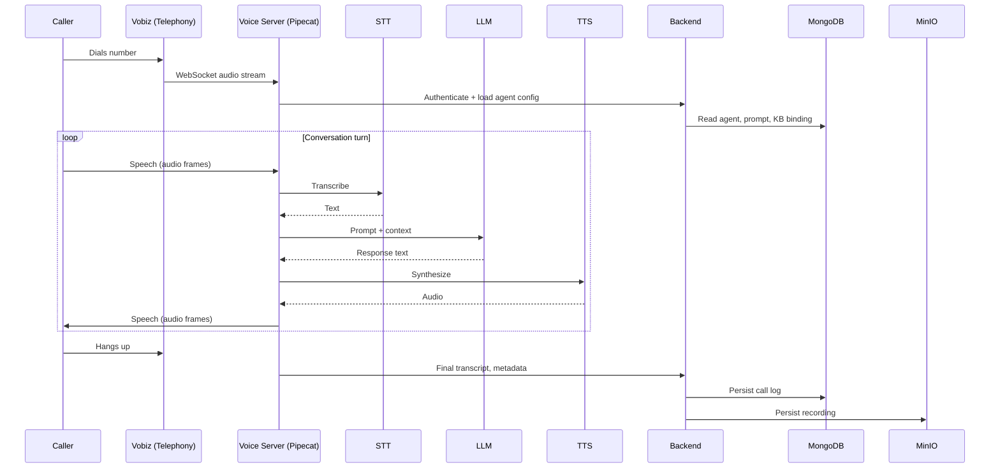

# How it works

A VoicEra call is a real-time loop between three services and a chain of AI models. This page traces a single inbound call from phone ring to logged transcript.

## The call loop

## What runs where

| Step | Service | Responsibility |
| --- | --- | --- |
| Call arrives | **Vobiz** | Converts PSTN audio to a WebSocket stream. |
| Audio in | **Voice server** | Receives frames, runs voice activity detection. |
| Speech → text | **STT** | AI4Bharat or hosted (Deepgram, etc.). |
| Decide reply | **LLM** | OpenAI, custom endpoint, or self-hosted. Uses agent prompt + optional [RAG](../concepts/knowledge-base-rag.md). |
| Text → speech | **TTS** | AI4Bharat or hosted (Cartesia, etc.). |
| Audio out | **Voice server** | Streams response back; handles interruptions. |
| Persist | **Backend** | Writes the transcript, metadata, recording. |

See [Voice pipeline](../concepts/voice-pipeline.md) for the full Pipecat pipeline (16 stages including barge-in, silence detection, and turn endpointing).

## Latency budget

A natural conversational turn aims for **under 1.5 seconds** end-to-end:

| Stage | Typical | Notes |
| --- | --- | --- |
| Network + VAD | ~100 ms | End-of-utterance detection. |
| STT | 200–400 ms | Streaming reduces this further. |
| LLM | 400–800 ms | Largest variable. RAG adds retrieval cost. |
| TTS first chunk | 150–300 ms | Streaming TTS speaks while generating. |
| Network out | ~100 ms | |

Local AI4Bharat servers eliminate hosted-API round-trips at the cost of GPU hardware. See [AI4Bharat STT](../services/ai4bharat-stt.md).

## Where state lives

* **Per-call state** — voice server memory (the WebSocket session).
* **Agent config, users, call logs** — MongoDB.
* **Transcripts, recordings, KB uploads** — MinIO.
* **API keys for hosted providers** — encrypted in MongoDB via [Integrations](../services/integrations.md).

## Next steps

* [Architecture](../concepts/architecture.md) — full C4 view.
* [Data flow](../concepts/data-flow.md) — inbound, outbound, and webhooks.
* [Voice pipeline](../concepts/voice-pipeline.md) — Pipecat internals.
