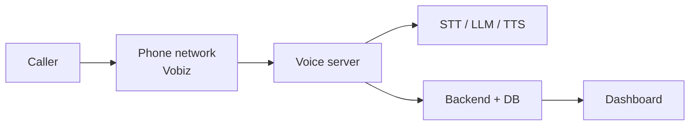

# What is VoicEra

**VoicEra is a platform for running AI phone agents that answer or place calls in Indian languages.** A web dashboard lets you configure each agent, view call history, listen to recordings, and link real phone numbers — without writing code.

This page is for programme managers, district IT officers, and operators. For technical setup, see [Prerequisites](../quickstart/prerequisites.md) and [Architecture](../concepts/architecture.md).

## The problem it solves

Government departments, NGOs, and service providers often need phone lines that can:

* Answer many calls at once in local languages.
* Follow a script or a [knowledge base](../concepts/knowledge-base-rag.md).
* Log who called and what was said.
* Place outbound calls (campaigns, surveys, reminders).

VoicEra provides the software stack to do this. A **telephony provider** — typically [Vobiz](../concepts/telephony-model.md) — connects real phone numbers into the system.

## The main parts

| Part | What it does | Analogy |
| --- | --- | --- |
| **Dashboard** | Create agents, link phone numbers, view calls. | Control panel |
| **Backend** | Saves users, agents, and call history. | Filing cabinet + rules |
| **Voice server** | Handles the live conversation on each call. | The AI on the phone |
| **MongoDB** | Stores settings and records. | Filing cabinet storage |
| **MinIO** | Stores recordings and uploaded files. | Audio archive |
| **AI4Bharat servers** (optional) | Run speech models on your own hardware. | In-house interpreters |

## How a call flows

1. Someone dials your number (or VoicEra dials them).
2. **Vobiz** routes the call to your **voice server** over the internet.
3. The voice server **listens** (STT), **decides what to say** (LLM), and **speaks** (TTS).
4. The **backend** logs the call; the **dashboard** displays it.
5. Recordings, if enabled, are saved to **MinIO**.

## What is an "agent"?

An **agent** is a configured virtual call handler — **not** a human. Each agent defines:

* Language and voice (which STT/TTS/LLM to use)
* Instructions (system prompt)
* Optional knowledge base
* Which phone number(s) route to it

One deployment can host many agents — for example, a Hindi helpline, a Marathi survey bot, and a Tamil appointment scheduler — running side by side.

## Who does what

| Operators | Hosting partner |
| --- | --- |
| Log into dashboard | Install server, Docker, HTTPS |
| Create agents | Configure environment URLs |
| Enter API keys in **Integrations** | Start/stop services, backups |
| Link phone numbers | Firewall, DNS, log monitoring |


**Vobiz Auth ID and Auth Token** belong in **Dashboard → Integrations**, not in server `.env` files. See [Integrations](../services/integrations.md).


## Next steps

* [How it works](how-it-works.md) — the 60-second technical narrative.
* [Use cases](use-cases.md) — what teams build with VoicEra.
* [Prerequisites](../quickstart/prerequisites.md) — what you need before installing.
* [Glossary](../concepts/glossary.md) — terms in one place.
