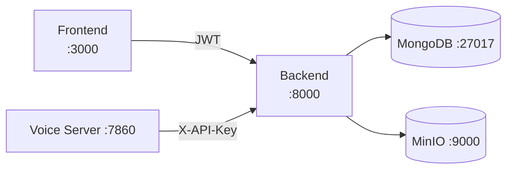

# Backend

The Backend is the central REST API for VoicEra. It owns persistence (MongoDB), object storage (MinIO), authentication, and all dashboard-facing CRUD. Voice Server and Frontend both depend on it.

Default port: **8000**. Swagger UI: `http://localhost:8000/docs`.

## Responsibilities

- User auth (JWT) and organisation membership
- Agents / assistants CRUD and per-agent provider config
- Telephony resources: Vobiz / Plivo numbers, applications, webhooks
- Campaigns, batches, meetings, and call recordings metadata
- Integrations storage (provider API keys per `org_id`)
- Custom LLM integrations (multiple OpenAI-compatible endpoints per org)
- Knowledge base ingestion + RAG retrieval
- Internal endpoints consumed by the Voice Server (`X-API-Key` / `INTERNAL_API_KEY`)

## Architecture

FastAPI app backed by MongoDB. MinIO holds call recordings and KB documents. The Voice Server calls a small set of internal endpoints to fetch agent config and decrypted integration keys at call time.



## Configuration

Copy `voicera_backend/env.example` to `.env`. Key variables:

| Variable | Purpose |
|----------|---------|
| `MONGODB_HOST` / `MONGODB_PORT` / `MONGODB_USER` / `MONGODB_PASSWORD` / `MONGODB_DATABASE` | Database connection |
| `SECRET_KEY` | JWT signing |
| `INTERNAL_API_KEY` | Shared secret used by the Voice Server to call internal endpoints |
| `MINIO_ENDPOINT` / `MINIO_ACCESS_KEY` / `MINIO_SECRET_KEY` | Object storage |
| `FRONTEND_URL` | Used in email links and CORS |
| `CORS_ORIGINS` | Allowed origins for the dashboard |

Dependencies that must be reachable before the Backend is useful:

| Service | Port | Role |
|---------|------|------|
| MongoDB | 27017 | Primary datastore |
| MinIO   | 9000 / 9001 | Recordings, KB files |

See [environment-variables.md](../reference/environment-variables.md) for the full list.

## Endpoints / API surface

Public REST endpoints are documented in [reference/rest-api.md](../reference/rest-api.md). A short cheatsheet is in [reference/endpoints-cheatsheet.md](../reference/endpoints-cheatsheet.md).

High-level groups:

| Group | Path prefix | Auth |
|-------|-------------|------|
| Auth | `/api/v1/users` | Public + JWT |
| Agents | `/api/v1/agents` | JWT |
| Telephony (Vobiz / Plivo) | `/api/v1/telephony` | JWT |
| Campaigns / batches | `/api/v1/campaigns` | JWT |
| Meetings / call logs | `/api/v1/meetings` | JWT |
| Integrations | `/api/v1/integrations` | JWT (+ `X-API-Key` for `bot/get-api-key`) |
| Custom LLM integrations | `/api/v1/custom-llm-integrations` | JWT (+ `X-API-Key` for `bot/get-config`) |
| Knowledge base | `/api/v1/knowledge` | JWT |
| Health | `/health` | Public |

## How it talks to other services

- **Frontend** calls the Backend with a user JWT.
- **Voice Server** calls Backend internal endpoints with `X-API-Key: ${INTERNAL_API_KEY}` to:
  - load the agent config when a call starts (`fetch_agent_config_from_backend` in the voice server)
  - fetch the org's provider API key for the configured LLM / STT / TTS (`/api/v1/integrations/bot/get-api-key`)
  - fetch the full config for a Custom LLM (`/api/v1/custom-llm-integrations/bot/get-config`)
- **MinIO** is used directly by both Backend (KB and uploads) and Voice Server (call recordings).


`INTERNAL_API_KEY` must match between Backend and Voice Server `.env`. If they differ, agents fail to load and provider keys cannot be retrieved.


## Data model (high level)

Persisted in MongoDB. The exact field set lives in `voicera_backend/app/models/`.

- **User** — id, email, password hash, role, org membership
- **Organisation** — id, name, owner, members
- **Agent / Assistant** — `llm_model`, `stt_model`, `tts_model`, language, system prompt, greeting, KB linkage
- **Integration** — `{ org_id, model, api_key }` per provider key
- **CustomLLMIntegration** — `{ org_id, name, base_url, api_key, model }` (multiple rows per org)
- **PhoneNumber** — Vobiz / Plivo number + application linkage
- **Campaign / Batch** — agent_id, schedule, contact list, status
- **Meeting / CallLog** — campaign + agent + phone + transcript + recording reference + analytics
- **KnowledgeBaseDocument** — original file, chunked embeddings collection name

## Knowledge base / RAG

The Backend ingests documents into MinIO, chunks them, computes embeddings (OpenAI), and serves retrieval to the Voice Server at call time. The architecture is described in [concepts/knowledge-base-rag.md](../concepts/knowledge-base-rag.md).


KB embeddings require an **OpenAI integration configured for the org** (Dashboard -> Integrations). The global `OPENAI_API_KEY` env var is not used for KB ingest or retrieval.


## Running



```bash
make build-backend-services
make start-backend-services
```

Service name: `backend` on port `8000`.



```bash
cd voicera_backend
python3 -m venv .venv && source .venv/bin/activate
pip install -r requirements.txt
cp env.example .env
python run.py
```



## Troubleshooting

- [troubleshooting/common-issues.md](../troubleshooting/common-issues.md)
- 401s and "integration not found" usually mean a missing or mismatched `INTERNAL_API_KEY`.

## Next steps

- [concepts/architecture.md](../concepts/architecture.md)
- [services/integrations.md](integrations.md)
- [reference/rest-api.md](../reference/rest-api.md)
- [guides/deployment/docker-compose.md](../guides/deployment/docker-compose.md)
