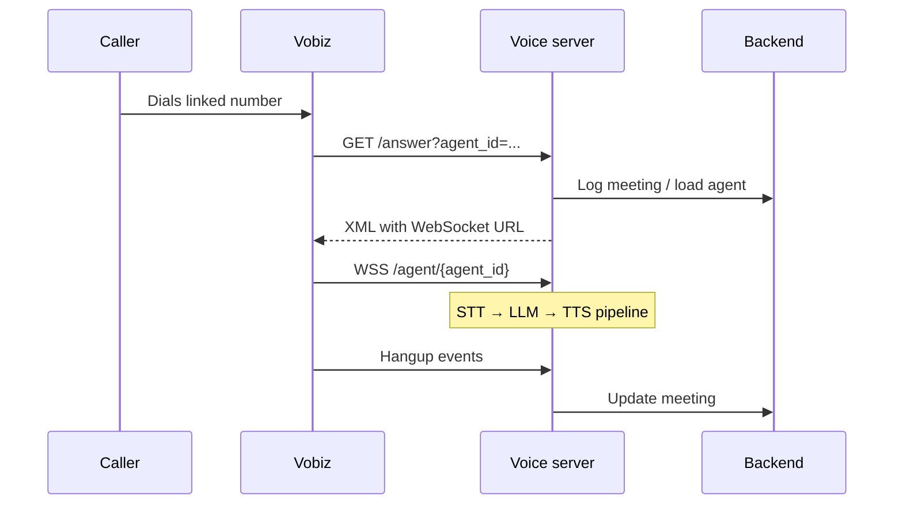

# Telephony (Vobiz)

How phone calls connect to VoicEra through **Vobiz**.

## Credentials: Integrations, not `.env`

**Vobiz Auth ID** and **Vobiz Auth Token** are stored **per organization** in:

- **Dashboard → Integrations**
- MongoDB integration records
- Loaded at runtime by backend (`voicera_backend/app/services/vobiz.py`) and voice server outbound calls

Do **not** document normal setup as putting Vobiz auth in `voice_2_voice_server/.env`.

### Environment variables (infrastructure only)

| Variable | Service | Purpose |
|----------|---------|---------|
| `VOBIZ_API_BASE` | voice server | Vobiz API base URL |
| `VOBIZ_CALLER_ID` | voice server | Optional default outbound caller ID |
| `JOHNAIC_SERVER_URL` | voice server | Public HTTPS base for webhooks — [Public URLs](../deployment/public-voice-urls.md) |
| `JOHNAIC_WEBSOCKET_URL` | voice server | Public WSS base for audio |
| `NEXT_PUBLIC_JOHNAIC_SERVER_URL` | frontend | Builds answer URLs when creating agents |
| `VOBIZ_API_BASE_URL` | backend | Application CRUD against Vobiz API |

## Inbound call flow

1. Caller dials a number linked to a Vobiz **application**.
2. Vobiz requests `{PUBLIC_HTTPS_URL}/answer?agent_id=<uuid>`.
3. On `Event=StartApp`, voice server returns XML with WebSocket URL `{PUBLIC_WSS_URL}/agent/{agent_id}`.
4. Audio streams; Pipecat pipeline runs (`voice_2_voice_server/api/bot.py`).
5. Hangup events update the meeting in the backend.

**Code:** `voice_2_voice_server/api/server.py` — `vobiz_answer_webhook`, `websocket_endpoint`

## Outbound call flow

1. Trigger: `POST /outbound/call/` on voice server.
2. Server loads agent config from backend.
3. Reads `telephony_provider` (default Vobiz).
4. Loads Vobiz auth from **Integrations** for the agent's `org_id`.
5. POST to `{VOBIZ_API_BASE}/Account/{auth_id}/Call/`.

## Dashboard setup (operators)

1. **Integrations** — enter Vobiz Auth ID and Token.
2. **Assistants** — create agent; telephony provider Vobiz.
3. System creates Vobiz application with answer URL `{NEXT_PUBLIC_JOHNAIC_SERVER_URL}/answer?agent_id={id}`.
4. **Phone numbers** — link purchased number to the agent's application.

## WebSocket audio

| Path | Purpose |
|------|---------|
| `/agent/{agent_id}` | Vobiz and browser test audio |

### Protocol summary

1. Connect; server loads agent config.
2. First message JSON: `{"event":"start","start":{"callSid":"...","streamSid":"..."}}`
3. Uplink media: `event: media`, L16 PCM base64, **16 kHz**
4. Downlink: play-audio frames from server

Details: [WebSocket API](../api/websocket-api.md) and `voice_2_voice_server/docs/talk-on-browser-feature.md`.

## Call states (simplified)

| Stage | Behavior |
|-------|----------|
| Answered | Vobiz hits `/answer` |
| StartApp | XML + WebSocket URL returned |
| Streaming | STT → LLM → TTS active |
| Hangup | Meeting metadata saved |
| User busy | `HangupCause=USER_BUSY` logged |

## Plivo

The dashboard may show **Plivo** as disabled on some builds. When enabled in a future release, credentials will also live under **Integrations**, with webhooks under `/plivo/answer` and WebSocket `/plivo/agent/{agent_id}`. Check your deployment version before documenting Plivo for operators.

## Related

- [Integrations](integrations.md)
- [Public voice server URLs](../deployment/public-voice-urls.md)
- [Dashboard walkthrough](../guide/dashboard.md)
