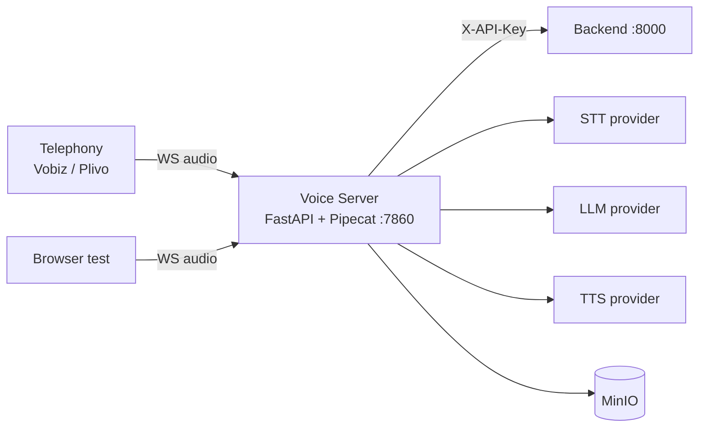

# Voice Server

The Voice Server runs the live audio pipeline for every call: telephony or browser audio in, STT -> LLM -> TTS, audio out. It is a FastAPI application embedding a Pipecat `Pipeline` / `PipelineRunner`.

Default port: **7860**.

## Responsibilities

- Accept inbound telephony webhooks (Vobiz `/answer`, Plivo equivalents)
- Place outbound calls via `POST /outbound/call/`
- Stream audio over WebSocket (`/agent/{agent_type}`) using the Vobiz serializer
- Run the Pipecat pipeline per call: STT, LLM, TTS
- Fetch agent config and provider API keys from the Backend at call start
- Upload recordings and transcripts to MinIO
- Bridge browser test calls (Talk-on-Browser feature)

## Architecture

The pipeline and its providers are chosen **per agent** in the Backend (`llm_model`, `stt_model`, `tts_model`). There is **no automatic fallback** between cloud and local AI4Bharat providers; whatever the agent is configured with is what runs.



See [concepts/voice-pipeline.md](../concepts/voice-pipeline.md) for the full data flow.

## Configuration

Copy `voice_2_voice_server/.env.example` (or set env vars directly). Selected variables:

| Variable | Required | Default | Description |
|----------|----------|---------|-------------|
| `VOBIZ_API_BASE` | Yes | - | Vobiz API base URL |
| `VOBIZ_AUTH_ID` | Yes* | - | Vobiz account auth ID (production keys live in Backend Integrations) |
| `VOBIZ_AUTH_TOKEN` | Yes* | - | Vobiz account auth token (production keys live in Backend Integrations) |
| `VOBIZ_CALLER_ID` | No | - | Default outbound caller ID |
| `JOHNAIC_SERVER_URL` | Yes | - | Public HTTPS base for telephony webhooks |
| `JOHNAIC_WEBSOCKET_URL` | Yes | - | Public `wss://` base for the audio WebSocket |
| `SAMPLE_RATE` | No | `8000` | Telephony audio sample rate (Hz) |
| `MINIO_ENDPOINT` | Yes | - | e.g. `localhost:9000` |
| `MINIO_ACCESS_KEY` | Yes | - | MinIO access key |
| `MINIO_SECRET_KEY` | Yes | - | MinIO secret key |
| `MINIO_SECURE` | No | `false` | Use HTTPS for MinIO |
| `VOICERA_BACKEND_URL` | No | `http://localhost:8000` | Backend base URL |
| `INTERNAL_API_KEY` | Yes | - | Must match Backend |
| `OPENAI_API_KEY` | * | - | Provider key (falls back when no Integration set) |
| `DEEPGRAM_API_KEY` | * | - | Provider key |
| `CARTESIA_API_KEY` | * | - | Provider key |
| `GOOGLE_STT_CREDENTIALS_PATH` | * | `credentials/google_stt.json` | Google STT credentials file |
| `GOOGLE_TTS_CREDENTIALS_PATH` | * | `credentials/google_tts.json` | Google TTS credentials file |
| `INDIC_STT_SERVER_URL` | * | - | AI4Bharat STT base URL (`/transcribe` and `/transcribe/bhili` appended) |
| `INDIC_TTS_SERVER_URL` | * | - | AI4Bharat TTS base URL |
| `KENPATH_JWT_PRIVATE_KEY_PATH` | * | - | RS256 private key for Kenpath Vistaar streaming |
| `KENPATH_VISTAAR_API_URL_PROD` | No | `https://voice-prod.mahapocra.gov.in` | Kenpath prod base |
| `KENPATH_VISTAAR_API_URL_DEV` | No | `https://vistaar-dev.mahapocra.gov.in` | Kenpath dev base |
| `KENPATH_VOICE_BHILI_URL` | No | `https://vistaar-dev.mahapocra.gov.in/api/voice-bhili` | Voice Bhili GET endpoint (agent `language=bhb`) |

`*` Required based on configured providers / when not provided via Backend Integrations.


For production telephony, store **Vobiz Auth ID** and **Vobiz Auth Token** in **Dashboard -> Integrations**, not in `voice_2_voice_server/.env`. The Voice Server reads them per `org_id` from the Backend.


## Endpoints / API surface

| Endpoint | Method | Purpose |
|----------|--------|---------|
| `/` | GET | Status |
| `/health` | GET | Health |
| `/docs` | GET | Swagger |
| `/outbound/call/` | POST | Initiate outbound call |
| `/answer` | GET / POST | Vobiz answer webhook |
| `/agent/{agent_type}` | WebSocket | Audio streaming |

WebSocket protocol details: [reference/websocket-api.md](../reference/websocket-api.md).

## How it talks to other services

- **Backend** — `X-API-Key: ${INTERNAL_API_KEY}` to fetch agent config (`fetch_agent_config_from_backend`), integration keys, custom LLM config, and KB retrieval at call time.
- **MinIO** — direct upload of recordings and transcripts.
- **Telephony** — Vobiz or Plivo controls the call leg; the Voice Server bridges the audio over WebSocket using `serializer/vobiz_serializer.py`.
- **AI4Bharat STT/TTS** — optional HTTP / WebSocket clients in `services/ai4bharat/` (only used when an agent selects `indic-conformer-stt` or `indic-parler-tts`).

## Pipecat pipeline

The pipeline is constructed in `voice_2_voice_server/api/bot.py` and the per-call services in `voice_2_voice_server/api/services.py`. Provider mappings live in `config/llm_mappings.py`, `config/stt_mappings.py`, `config/tts_mappings.py`.

```
audio in -> STT -> LLM -> TTS -> audio out
```

A simplified flow:

```python
# api/bot.py (sketch)
pipeline = Pipeline([
    transport.input(),
    stt_service,
    llm_context_aggregator.user(),
    llm_service,
    tts_service,
    transport.output(),
    llm_context_aggregator.assistant(),
])
runner = PipelineRunner()
await runner.run(PipelineTask(pipeline))
```

## Supported providers

Configured per agent in the dashboard. The following keys are recognised by the Voice Server.

### LLM

| Provider key | Notes |
|--------------|-------|
| `openai` | gpt-4o, gpt-4o-mini, gpt-3.5-turbo |
| `anthropic` | Claude (via Backend Integration) |
| `grok` | xAI Grok (via Backend Integration) |
| `kenpath` | Vistaar streaming API; agent `language=bhb` uses Voice Bhili `GET` JSON API at `KENPATH_VOICE_BHILI_URL` |
| Custom LLM | OpenAI-compatible endpoint stored in `CustomLLMIntegrations`; agent uses `llm_model.name = "Custom LLM"` + `custom_llm_id` |

### STT

| Provider key | Notes |
|--------------|-------|
| `deepgram` | nova-3, nova-2, flux-general-en |
| `google` | chirp_3, chirp_2, telephony |
| `openai` | whisper-1 |
| `indic-conformer-stt` | AI4Bharat local server; agent `language=bhb` calls `POST /transcribe/bhili` |
| `bhashini` | Bhashini cloud STT |

### TTS

| Provider key | Notes |
|--------------|-------|
| `deepgram` | Aura voices (e.g. `aura-2-helena-en`); set `args.voice` |
| `cartesia` | sonic-3, sonic-2, sonic-multilingual |
| `google` | Various voices |
| `openai` | alloy, echo, fable, onyx, nova, shimmer |
| `indic-parler-tts` | AI4Bharat local server (WebSocket, 44.1 kHz float32) |
| `bhashini` | Bhashini cloud TTS |

Language code mappings per provider live in `voice_2_voice_server/config/stt_mappings.py` and `tts_mappings.py`. Bhili uses the agent code `bhb`.

## Browser test (Talk on Browser)

The dashboard ships a browser test client that connects directly to `JOHNAIC_WEBSOCKET_URL/agent/{agent_type}`. Both URLs must be reachable from the operator's browser. See [guides/deployment/public-voice-urls.md](../guides/deployment/public-voice-urls.md).

## Running



```bash
make start-voice-only-services
```

Service: `voice_server` on port `7860`.



```bash
cd voice_2_voice_server
python -m venv venv && source venv/bin/activate
pip install -r requirements.txt
python main.py
```



## Troubleshooting

- [troubleshooting/voice-and-audio.md](../troubleshooting/voice-and-audio.md)
- [troubleshooting/telephony.md](../troubleshooting/telephony.md)
- [troubleshooting/common-issues.md](../troubleshooting/common-issues.md)

## Next steps

- [concepts/voice-pipeline.md](../concepts/voice-pipeline.md)
- [services/integrations.md](integrations.md)
- [services/ai4bharat-stt.md](ai4bharat-stt.md)
- [services/ai4bharat-tts.md](ai4bharat-tts.md)
